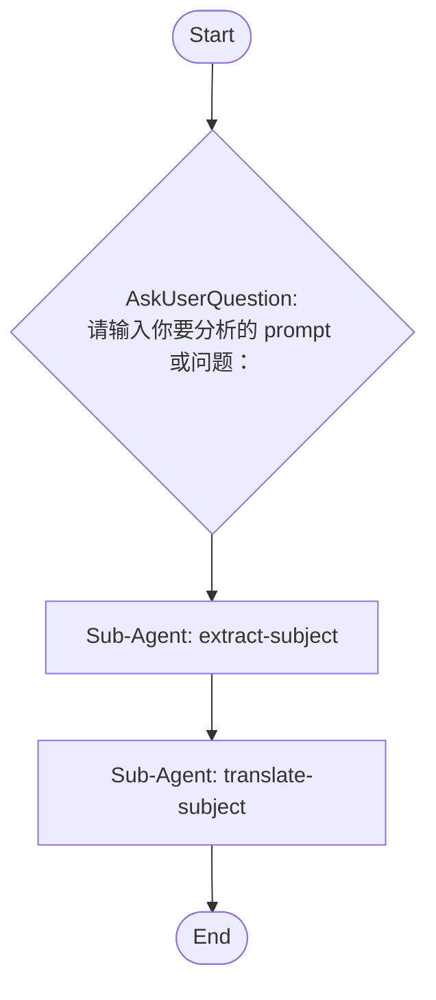

# source-command-subject-multilingual-extractor

Use this skill when the user asks to run the migrated source command `subject-multilingual-extractor`.

## Command Template

## Workflow diagram


```

## Workflow Execution Guide

Follow the Mermaid flowchart above to execute the workflow. Each node type has specific execution methods as described below.

### Execution Methods by Node Type

- **Rectangle nodes (Sub-Agent: ...)**: Execute Sub-Agents
- **Diamond nodes (AskUserQuestion:...)**: Use the AskUserQuestion tool to prompt the user and branch based on their response
- **Diamond nodes (Branch/Switch:...)**: Automatically branch based on the results of previous processing (see details section)
- **Rectangle nodes (Prompt nodes)**: Execute the prompts described in the details section below

## Sub-Agent Node Details

#### extract-subject(Sub-Agent: extract-subject)

**subagent_type**: explore

**Description**: Extract subject from text

**Prompt**:

```
分析用户输入的文本，提取其中的主语（subject）。识别文本的核心主题、主要人物、对象或概念。输出提取到的主语及其简要说明。
```

**Parallel Execution**: enabled

When executing this node, assess whether the task involves multiple independent areas or concerns.
If so, launch multiple agents of the same subagent_type in parallel — one per independent area.

Guidelines:
- Single area of concern → execute with 1 agent
- Multiple independent areas → spawn 1 agent per area, execute in parallel
- Wait for all agents to complete before proceeding to the next node
- Consolidate all agent results before passing to the next node

#### translate-subject(Sub-Agent: translate-subject)

**subagent_type**: general-purpose

**Description**: Translate to multiple languages

**Prompt**:

```
将提取的主语翻译成多种语言：中文、英文、日文、韩文、法文、德文、西班牙文。以表格形式输出各语言版本的主语表达。
```

**Parallel Execution**: enabled

When executing this node, assess whether the task involves multiple independent areas or concerns.
If so, launch multiple agents of the same subagent_type in parallel — one per independent area.

Guidelines:
- Single area of concern → execute with 1 agent
- Multiple independent areas → spawn 1 agent per area, execute in parallel
- Wait for all agents to complete before proceeding to the next node
- Consolidate all agent results before passing to the next node

### AskUserQuestion Node Details

Ask the user and proceed based on their choice.

#### ask-input(请输入你要分析的 prompt 或问题：)

**Selection mode:** AI Suggestions (AI generates options dynamically based on context and presents them to the user)


## Source file

Canonical workflow JSON: `.vscode/workflows/subject-multilingual-extractor.json`

When the canvas changes in Wise CC Workflow Studio, use the `cc-workflow-studio` MCP server (`get_current_workflow` / `apply_workflow`) to stay aligned before executing steps that depend on the latest node data.
