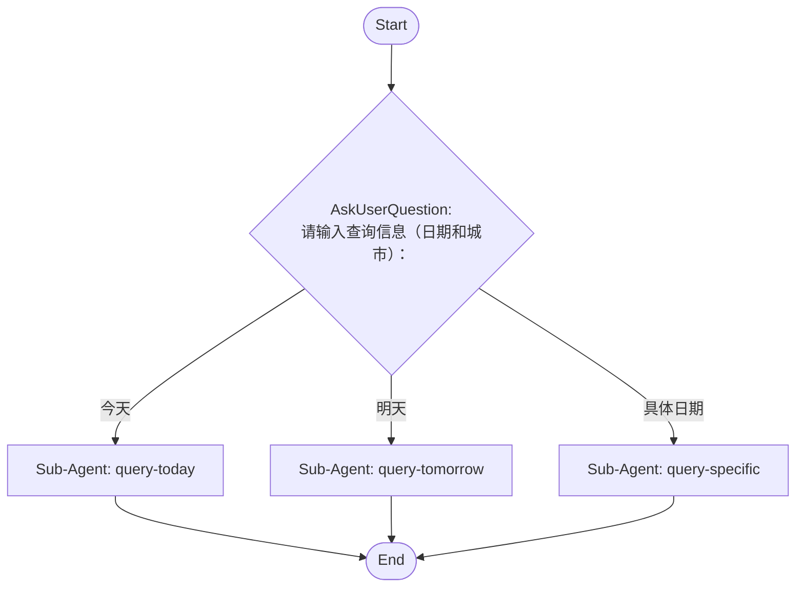

# source-command-weather-query

Use this skill when the user asks to run the migrated source command `weather-query`.

## Command Template

## Workflow diagram


```

## Workflow Execution Guide

Follow the Mermaid flowchart above to execute the workflow. Each node type has specific execution methods as described below.

### Execution Methods by Node Type

- **Rectangle nodes (Sub-Agent: ...)**: Execute Sub-Agents
- **Diamond nodes (AskUserQuestion:...)**: Use the AskUserQuestion tool to prompt the user and branch based on their response
- **Diamond nodes (Branch/Switch:...)**: Automatically branch based on the results of previous processing (see details section)
- **Rectangle nodes (Prompt nodes)**: Execute the prompts described in the details section below

## Sub-Agent Node Details

#### query-today(Sub-Agent: query-today)

**subagent_type**: general-purpose

**Description**: Query today's weather

**Prompt**:

```
查询用户指定城市今天的天气情况。返回温度、天气状况、湿度等信息。
```

**Parallel Execution**: enabled

When executing this node, assess whether the task involves multiple independent areas or concerns.
If so, launch multiple agents of the same subagent_type in parallel — one per independent area.

Guidelines:
- Single area of concern → execute with 1 agent
- Multiple independent areas → spawn 1 agent per area, execute in parallel
- Wait for all agents to complete before proceeding to the next node
- Consolidate all agent results before passing to the next node

#### query-tomorrow(Sub-Agent: query-tomorrow)

**subagent_type**: general-purpose

**Description**: Query tomorrow's weather

**Prompt**:

```
查询用户指定城市明天的天气情况。返回温度、天气状况、湿度等信息。
```

**Parallel Execution**: enabled

When executing this node, assess whether the task involves multiple independent areas or concerns.
If so, launch multiple agents of the same subagent_type in parallel — one per independent area.

Guidelines:
- Single area of concern → execute with 1 agent
- Multiple independent areas → spawn 1 agent per area, execute in parallel
- Wait for all agents to complete before proceeding to the next node
- Consolidate all agent results before passing to the next node

#### query-specific(Sub-Agent: query-specific)

**subagent_type**: general-purpose

**Description**: Query specific date weather

**Prompt**:

```
查询用户指定城市和具体日期的天气情况。返回温度、天气状况、湿度等信息。
```

**Parallel Execution**: enabled

When executing this node, assess whether the task involves multiple independent areas or concerns.
If so, launch multiple agents of the same subagent_type in parallel — one per independent area.

Guidelines:
- Single area of concern → execute with 1 agent
- Multiple independent areas → spawn 1 agent per area, execute in parallel
- Wait for all agents to complete before proceeding to the next node
- Consolidate all agent results before passing to the next node

### AskUserQuestion Node Details

Ask the user and proceed based on their choice.

#### ask-input(请输入查询信息（日期和城市）：)

**Selection mode:** Single Select (branches based on the selected option)

**Options:**
- **今天**: 查询今天的天气
- **明天**: 查询明天的天气
- **具体日期**: 输入具体日期，如 2026-05-16


## Source file

Canonical workflow JSON: `.vscode/workflows/weather-query.json`

When the canvas changes in Wise CC Workflow Studio, use the `cc-workflow-studio` MCP server (`get_current_workflow` / `apply_workflow`) to stay aligned before executing steps that depend on the latest node data.
