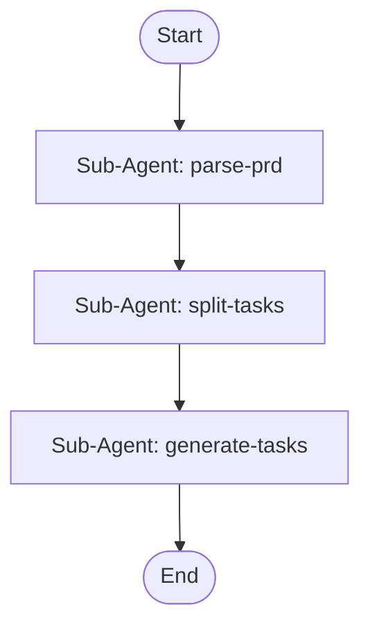

## Workflow diagram


```

## Workflow Execution Guide

Follow the Mermaid flowchart above to execute the workflow. Each node type has specific execution methods as described below.

### Execution Methods by Node Type

- **Rectangle nodes (Sub-Agent: ...)**: Execute Sub-Agents
- **Diamond nodes (AskUserQuestion:...)**: Use the AskUserQuestion tool to prompt the user and branch based on their response
- **Diamond nodes (Branch/Switch:...)**: Automatically branch based on the results of previous processing (see details section)
- **Rectangle nodes (Prompt nodes)**: Execute the prompts described in the details section below

## Sub-Agent Node Details

#### parse-prd(Sub-Agent: parse-prd)

**subagent_type**: explore

**Description**: Parse PRD document

**Prompt**:

```
Read the PRD document and extract: key features, requirements, constraints, acceptance criteria, and dependencies.
```

**Parallel Execution**: enabled

When executing this node, assess whether the task involves multiple independent areas or concerns.
If so, launch multiple agents of the same subagent_type in parallel — one per independent area.

Guidelines:
- Single area of concern → execute with 1 agent
- Multiple independent areas → spawn 1 agent per area, execute in parallel
- Wait for all agents to complete before proceeding to the next node
- Consolidate all agent results before passing to the next node

#### split-tasks(Sub-Agent: split-tasks)

**subagent_type**: plan

**Description**: Plan task splitting

**Prompt**:

```
Based on PRD analysis, design task splitting strategy. Group requirements into logical tasks with appropriate granularity and clear dependencies.
```

**Parallel Execution**: enabled

When executing this node, assess whether the task involves multiple independent areas or concerns.
If so, launch multiple agents of the same subagent_type in parallel — one per independent area.

Guidelines:
- Single area of concern → execute with 1 agent
- Multiple independent areas → spawn 1 agent per area, execute in parallel
- Wait for all agents to complete before proceeding to the next node
- Consolidate all agent results before passing to the next node

#### generate-tasks(Sub-Agent: generate-tasks)

**subagent_type**: general-purpose

**Description**: Generate task files

**Prompt**:

```
Generate task files based on the splitting plan. Create individual task descriptions with scope, dependencies, and acceptance criteria.
```

**Parallel Execution**: enabled

When executing this node, assess whether the task involves multiple independent areas or concerns.
If so, launch multiple agents of the same subagent_type in parallel — one per independent area.

Guidelines:
- Single area of concern → execute with 1 agent
- Multiple independent areas → spawn 1 agent per area, execute in parallel
- Wait for all agents to complete before proceeding to the next node
- Consolidate all agent results before passing to the next node


## Source file

Canonical workflow JSON: `.vscode/workflows/prd-task-splitter.json`

When the canvas changes in Wise CC Workflow Studio, use the `cc-workflow-studio` MCP server (`get_current_workflow` / `apply_workflow`) to stay aligned before executing steps that depend on the latest node data.
