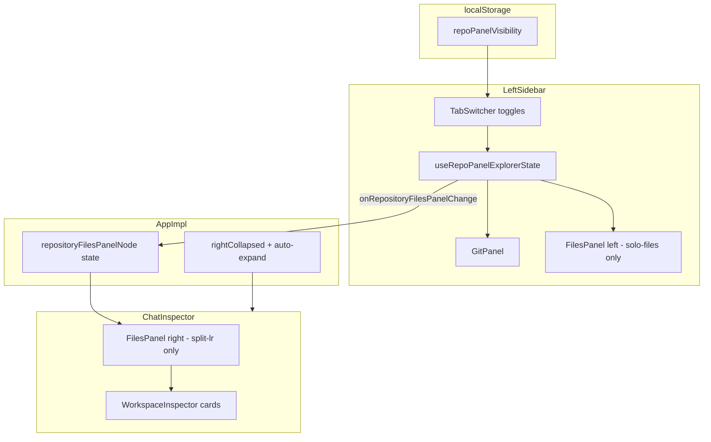

# Design — Git 与文件树左右栏组合/单独显示

## 1. 布局模型

```ts
/** 用户可见的面板开关（至少一项为 true） */
type RepoPanelVisibility = {
  git: boolean;
  files: boolean;
};

/** 由 visibility 推导的渲染布局 */
type RepoPanelLayout =
  | "solo-git"      // git only → 左栏
  | "solo-files"    // files only → 左栏
  | "split-lr";     // git 左 + files 右
```

推导规则：

| git | files | layout    | Git 渲染位置 | 文件树渲染位置 |
|-----|-------|-----------|--------------|----------------|
| T   | F     | solo-git  | 左栏底部     | —              |
| F   | T     | solo-files| —            | 左栏底部       |
| T   | T     | split-lr  | 左栏底部     | 右栏 Inspector |

不允许 `git=false && files=false`；toggle 时若将导致全关，则忽略该次点击。

## 2. 状态与持久化

**新存储键** `wise.leftPanel.repoPanelVisibility`：

```json
{ "git": true, "files": false }
```

**迁移**（`readRepoPanelVisibilityFromStorage`）：

- 若新键存在 → 解析并校验至少一项为 true。
- 否则读旧键 `wise.leftPanel.bottomTab`：`git` → `{git:true,files:false}`；`files` → `{git:false,files:true}`。
- 默认 `{git:true,files:false}`（与旧默认一致）。

废弃写入 `bottomTab`；读取保留兼容一个版本周期。

模块：`src/components/LeftSidebar/sidebarStorage.ts`（类型 + 读写 + 迁移 + 纯函数 `deriveRepoPanelLayout`）。

## 3. UI 组件变更

### 3.1 `LeftSidebarBottomTabSwitcher`

- Props 从 `activeTab + onChange(tab)` 改为 `visibility + onChange(visibility)`。
- 两个按钮改为 **toggle**：`aria-pressed`，可同时高亮。
- 点击已选且仅剩一项时：不响应（保持至少一项）。

### 3.2 `LeftSidebarBottomTabPanes`

- Props 增加 `layout: RepoPanelLayout`。
- `solo-git`：仅挂载/显示 git pane。
- `solo-files`：仅挂载/显示 files pane。
- `split-lr`：左栏仅显示 git pane（files pane 不在左栏渲染）。
- 继续 **保活** hidden panes（`split-lr` 时 git pane 仍保活；files 在右栏单独实例，见 §4）。

### 3.3 右栏 `ChatInspector`

新增可选 props：

```ts
repositoryFilesPanel?: ReactNode | null;
```

当 `split-lr` 时，在 `WorkspaceInspectorPanelsSection` **之前**插入文件树卡片（`app-chat-inspector-card` + `app-right-panel-files-explorer`），保证文件树在右栏可视区域上部。

样式：复用 `RepositoryFilesExplorer` / `ActiveRepositoryFilesPanel` 结构；右栏专用 class 调整高度（`flex:1; min-height:0`）与边框。

## 4. 状态提升（目录上下文共享）

左栏与右栏文件树必须共享：

- `effectiveRepoPanelPath` / 目录选择器 `repoPanelTreeSelection`
- `repositoryFileTreeSearch`
- `handleOpenExplorerFile`

**方案**：抽取 hook `useRepoPanelExplorerState`（新文件 `src/components/LeftSidebar/useRepoPanelExplorerState.ts`），从 `LeftSidebar.tsx` 迁出路径解析、`repoPanelTreeSelection` 同步、`gitPanelRepositoryEntries`、selector props、open file 等逻辑。

`LeftSidebar` 消费该 hook 并：

- 根据 `layout` 渲染左栏 git / files pane。
- 通过新 prop `onRepositoryFilesPanelChange?: (node: ReactNode | null) => void` 向父级上报右栏 files 节点（`useEffect` + `useMemo`），避免在 AppImpl 重复拼装。

`AppWorkspaceLayout` / `AppImpl`：

- 增加 `repositoryFilesPanelNode` state。
- `leftSidebarProps.onRepositoryFilesPanelChange` 写入 state。
- `chatInspectorProps.repositoryFilesPanel` 传入该节点。

组合模式进入时，`AppImpl` 已有 `effectiveRightCollapsed`；在 layout 变为 `split-lr` 时调用 `handleToggleRightPanel` 或专用 `ensureRightPanelExpanded()`（仅当当前收起时展开一次）。

## 5. 数据流示意



## 6. 兼容与边界

| 场景 | 行为 |
|------|------|
| 无有效仓库路径 `showRepoPanel=false` | 不显示底部区域；visibility 仍持久化 |
| 右栏全局 `chatRightRailMode=false` | 组合模式下降级为 `solo-git`（仅显示 Git），或阻止选中 files+git 同时——**采用降级 solo-git 并 toast 提示「当前布局无右栏，已仅显示 Git」** |
| Author / Cockpit 全屏 | 左栏 parked 时行为不变；右栏 files 随 right rail 隐藏 |
| 文件树 sectionCollapsed | 右栏实例独立持久化左栏 `filesExplorerCollapsed` 状态（共用同一 storage 键，两侧同步读取） |

## 7. 测试策略

| 文件 | 覆盖 |
|------|------|
| `sidebarStorage.test.ts` | 迁移、derive layout、无效 visibility 兜底 |
| `LeftSidebarBottomTabSwitcher.test.tsx` | toggle 逻辑、至少一项约束 |
| 可选 snapshot | layout class 名 |

## 8. 文件清单（预期改动）

- `src/components/LeftSidebar/sidebarStorage.ts` — 类型、迁移、推导
- `src/components/LeftSidebar/sidebarStorage.test.ts` — 新建
- `src/components/LeftSidebar/LeftSidebarBottomTabSwitcher.tsx`
- `src/components/LeftSidebar/LeftSidebarBottomTabPanes.tsx`
- `src/components/LeftSidebar/useRepoPanelExplorerState.ts` — 新建
- `src/components/LeftSidebar.tsx` — 接入 layout + 上报右栏 node
- `src/components/LeftSidebar/types.ts` — 新 prop
- `src/components/Inspector/ChatInspector.tsx` + `Inspector.css`
- `src/AppImpl.tsx` — state + auto-expand + props
- `src/App.css` — 右栏文件树布局（如需）
