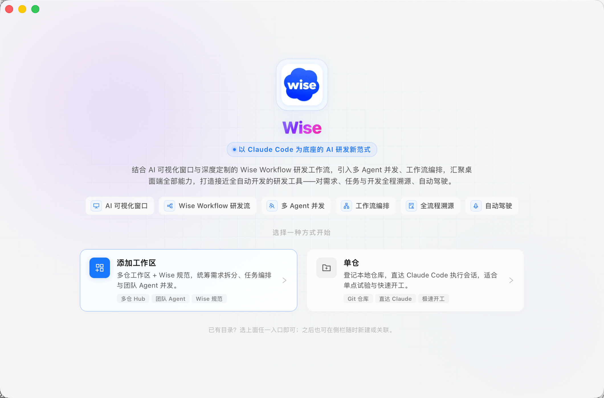
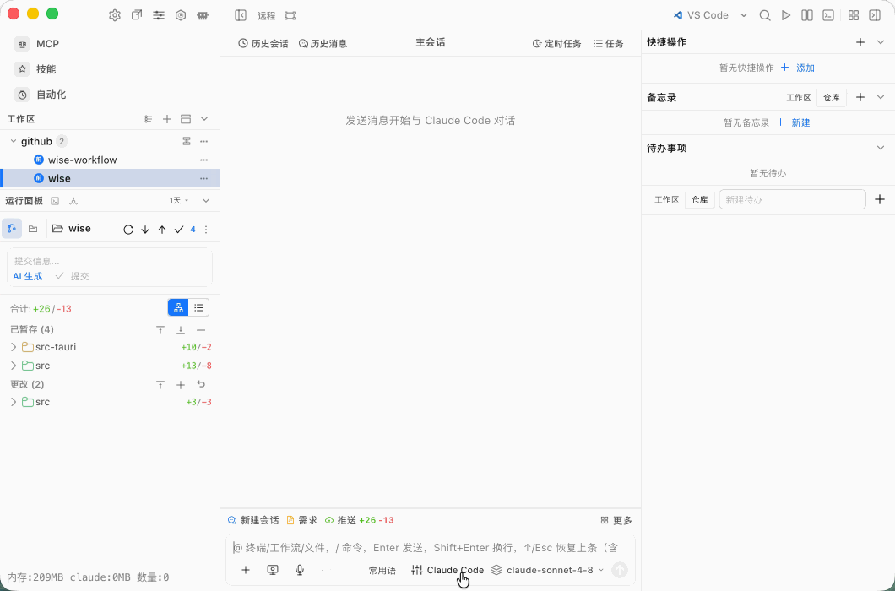

<p align="center">
  
</p>

<h1 align="center">Wise</h1>

<p align="center">
  <strong>A new AI R&D paradigm built on Claude Code</strong>
</p>

<p align="center">
  <a href="README.md">中文</a> · <a href="README.en.md">English</a>
</p>

---

Wise is a **Tauri 2** desktop AI workbench. It unifies **Claude Code** sessions, local Git repositories, visual workflows, PRD task splitting, multi-agent concurrency, and Mission orchestration in one window — so requirements, tasks, and code stay traceable, orchestrated, and close to autopilot.

<p align="center">
  
</p>

## Highlights

| Highlight | Description |
|-----------|-------------|
| **AI visualization window** | Claude Code sessions, Composer, terminal, and Git panels in one desktop surface |
| **Wise Workflow R&D flow** | Trellis conventions and Mission task chains from requirements → split → implement → review |
| **Multi-agent concurrency** | Team agents, subagents, and PRD split fan-out in parallel |
| **Workflow orchestration** | CC Workflow Studio visual graphs with templates and stage acceptance |
| **End-to-end traceability** | SQLite-backed sessions, task snapshots, run records, and notification inbox |
| **Autopilot mode** | Workspace-level orchestration plus execution environments for a near hands-free loop |

## Features

- **Repositories & workspaces** — Quick single-repo start, or multi-repo workspaces with Wise conventions
- **Claude Code sessions** — Create, restore, run, and cancel sessions; MCP, hooks, skills, and subagents in one place
- **PRD task splitting** — Parse PRD/source material, materialize executable task trees under `.trellis/tasks/`
- **Terminal & Git** — In-repo terminal, diff, history, branches, and worktrees
- **Execution environments & models** — Configure Claude models, API keys, and local/remote runtimes
- **Monitoring & notifications** — Background invocation details, team progress, and message inbox
- **Multi-window desktop** — Main window plus mascot overlay, sharing `~/.wise` app data

## Quick Start

### Requirements

- [Bun](https://bun.sh) (match `packageManager` in `package.json`, currently `bun@1.3.5`)
- Rust stable (Tauri 2 build and packaging)
- Platform prerequisites from the [Tauri 2 docs](https://v2.tauri.app/start/prerequisites/)

### Install & Run

```bash
# Install dependencies
bun install

# Development (Vite + Tauri desktop window)
bun run tauri:dev

# Run tests
bun test

# Production build
bun run build
bun run tauri:build
```

Bundles are emitted under `src-tauri/target/release/bundle/`. macOS distribution outside the App Store requires Developer ID signing and notarization; Windows builds benefit from code signing to reduce SmartScreen warnings.

### macOS DMG distribution notes

When users download a DMG from GitHub Releases, cloud storage, or chat apps and install it on **another Mac**, they may see **“is damaged and can’t be opened”**, **“can’t be opened”**, or **“from an unidentified developer”**. In most cases the bundle is not actually corrupt — macOS **Gatekeeper** is blocking an unsigned or unnotarized app and applying **quarantine** checks.

**End users can try:**

1. After dragging `Wise.app` into **Applications**, open **System Settings → Privacy & Security** and click **Open Anyway** at the bottom.
2. If the damaged warning persists, remove the quarantine attribute on the installed app (or the `.app` on the mounted DMG) and retry:

```bash
xattr -cr /Applications/Wise.app
```

> Only run this if you trust the source of the installer.

**Maintainer release checklist (before shipping):**

- [ ] Sign `.app` with an **Apple Developer ID Application** certificate (`codesign --verify --deep --strict` passes).
- [ ] Submit for **notarytool** notarization and `xcrun stapler staple` the DMG.
- [ ] Smoke-test on a **clean Mac that did not build the app**: download → mount DMG → drag to Applications → first launch — confirm no “damaged” block.
- [ ] Ship notarized DMGs in Releases; local `bun run tauri:build` output is for personal or internal use only, not as the public release artifact.

Unsigned or unnotarized DMGs showing “damaged” on other machines is **expected** — **always sign and notarize before a public release**.

## Usage Guide

Wise offers two entry points:

| Mode | Best for |
|------|----------|
| **Add workspace** | Multi-repo hub with Wise conventions — PRD splitting, task orchestration, team agents |
| **Single repo** | Register a local Git repo and jump straight into Claude Code for experiments and quick starts |

### 1. Create a workspace

Group multiple local repositories into a project workspace with Mission, Trellis conventions, and multi-agent collaboration.

<p align="center">
  
</p>

### 2. Configure models

Set Claude models and API credentials in the settings center for sessions and agent dispatch.

<p align="center">
  
</p>

### 3. Add execution environments

Bind execution environments (local Claude Code, remote channels, etc.) to workspaces or repos so agents run in the right context.

<p align="center">
  
</p>

### 4. Run tasks

Launch Claude sessions, PRD splits, or workflow stages from the cockpit and watch multi-agent execution with full traceability.

<p align="center">
  
</p>

> Tip: If you already have local directories, pick either entry on the welcome screen — or use the sidebar **+** button anytime to add or link repositories.

## Tech Stack

| Layer | Stack |
|-------|-------|
| Desktop shell | Tauri 2 + Rust |
| Frontend | React 19, TypeScript, Vite, Ant Design |
| Editors | Monaco, Milkdown, xterm.js |
| Workflows | CC Workflow Studio, @antv/x6 |
| Persistence | SQLite (`~/.wise/wise.db`) |

## Storage

Application data lives under `~/.wise/`:

| Path | Purpose |
|------|---------|
| `wise.db` | Projects, workflows, sessions, missions, task snapshots |
| `repositories.json` | Sidebar repository registry |
| `tabs.json` | Tab session state |
| `prd-images/`, `prd-runs/` | PRD assets and split run artifacts |
| `composer-images/` | Composer screenshots and uploads |

## Development

- Package manager: **Bun only** — keep `bun.lock` as the sole lockfile
- Coding rules: see `.trellis/spec/` (frontend / tauri / guides)
- For large changes, create or select a Trellis task under `.trellis/tasks/`
- Recommended IDE: VS Code with Tauri extension and rust-analyzer

## License

This project is licensed under the [Apache License 2.0](LICENSE).
