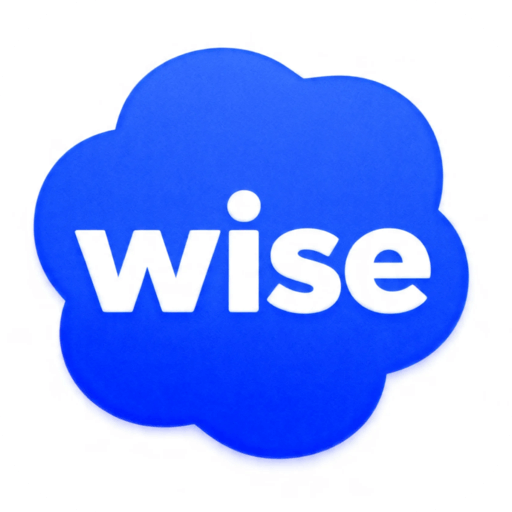
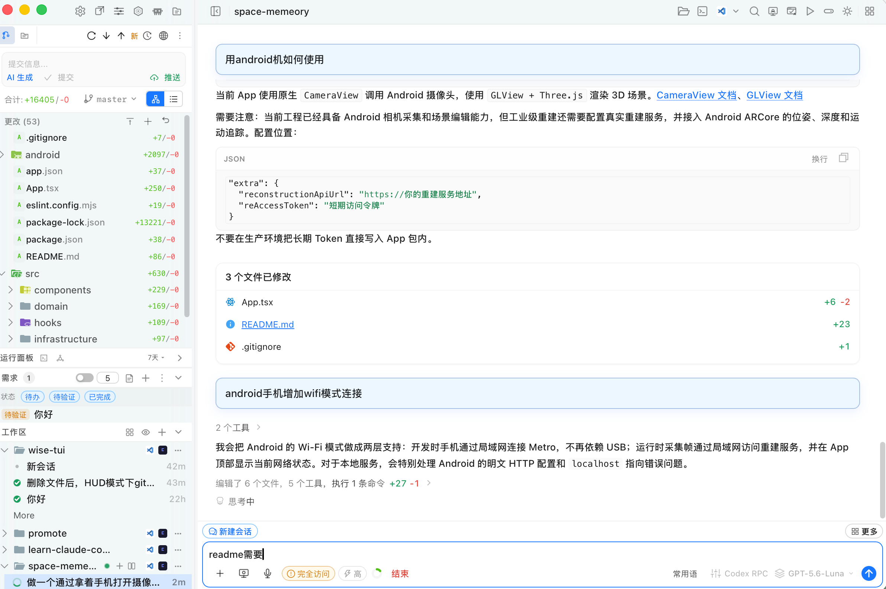

<p align="center">
  
</p>

<h1 align="center">Wise</h1>

<p align="center">
  <strong>A desktop AI engineering workbench for Agent-driven development</strong>
</p>

<p align="center">
  Workspaces, agents, runtimes, workflows, automation, channels, and artifacts in one developer console
</p>

<p align="center">
  <a href="README.md">中文</a> · <a href="README.en.md">English</a>
</p>

---

Wise is a **Tauri 2** desktop AI engineering workbench. It connects local Git repositories with AI sessions, terminals, editors, Git tools, workflows, and automation. It also provides a manageable ecosystem for Agents, skills, MCP servers, hooks, plugins, and extensions, plus remote channels such as DingTalk, Feishu, WeCom, Telegram, and WebSocket.

Wise is designed to move AI development beyond an isolated chat window into an executable, observable, and recoverable loop:

```text
Workspace & context → Agent / assistant → Runtime → Session / workflow → Code & artifacts → Review, automation & remote feedback
```

<p align="center">
  
</p>

## Highlights

| Highlight | What Wise provides |
| --- | --- |
| **From chat to workflow** | Sessions can be organized around tasks, stages, run state, acceptance results, and execution history instead of remaining isolated transcripts. |
| **One workbench, multiple engines** | Connect Claude Code, Codex RPC, Cursor Agent, Gemini CLI, OpenCode, and Qoder CLI in the same workspace and session experience. Availability depends on local CLI and account configuration. |
| **Manageable Agent supply** | Turn assistant templates, Agent registries, Skills, MCP, Hooks, plugins, and extensions into reusable engineering assets. |
| **Hub / Channel / Automation / Artifact surfaces** | Use Hubs to manage capabilities, Channels for remote requests and feedback, Automation for scheduled work, and Artifacts for inspecting results. |
| **Local-first traceability** | Repositories, sessions, run records, configuration, and artifact indexes stay on the local machine, with important execution paths available for inspection. |
| **Browser issues can enter the AI repair loop** | Page monitoring captures errors, network failures, Web Vitals, long tasks, slow requests, blank screens, and crashes, then dispatches issues with trails and evidence to an Agent. |
| **HUD floating entry point** | Switch repositories, sessions, runtimes, and models from an always-on-top capsule, then submit work, inspect status, and trigger quick actions without reopening the main window. |

## The workbench

### Workspaces: the context boundary for Agents

- Start with one repository, or organize multiple repositories into an advanced workspace.
- Each repository can have its own sessions, runtimes, shortcuts, requirements, scheduled tasks, and run state.
- Browse files, edit code, run terminals, and manage branches, diffs, history, and worktrees without leaving Wise.
- Keep workspace memos, global todos, and requirements close to the execution context.

### Sessions and runtimes: choose the right Agent for the job

- Create, restore, stop, and run multiple AI sessions in parallel.
- Use multi-pane layouts for sessions, terminals, files, and message lists.
- Select an execution engine per session, repository, or assistant and inspect local Agent availability.
- Use Composer for rich text, file / image context, snippets, voice input, and slash commands.
- Configure auto-approval, sandbox behavior, permissions, model profiles, usage, and session processes.

Supported execution environments include:

| Runtime | Best suited for |
| --- | --- |
| Claude Code | Default sessions, MCP, Skills, Hooks, and plugin ecosystem |
| Codex RPC | Codex App-Server JSON-RPC sessions |
| Cursor Agent | Cursor Agent ACP sessions and model selection |
| Gemini CLI | Gemini CLI coding sessions |
| OpenCode | OpenCode sessions, model switching, and configuration bridge |
| Qoder CLI | Qoder CLI streaming coding sessions |

### 3. HUD mode: a floating AI entry point

HUD is Wise’s lightweight always-on-top overlay for calling AI while you work in an editor, browser, or terminal. The main window can stay in the background while the compact capsule remains available and tasks continue running.

<p align="center">
  
</p>

- **Global toggle**: press `⌥H / Alt+H` to enter or exit HUD, even when the app is not focused. Use `⌘⇧G / Ctrl+Shift+G` to snap it to the current pointer position.
- **Context switching**: search and switch repositories, sessions, runtimes, and models from the overlay, or add a local repository directly.
- **Multi-session control**: view session tabs, running states, and completion notifications, then expand details to review the active session.
- **One-click execution**: create sessions, submit / stop tasks, activate assistant templates, run repository commands, and trigger workspace quick actions from HUD.
- **Context stays attached**: use rich text, `@` file context, images, slash commands, and desktop screenshots. Press `⌥Z / Alt+Z` to focus the composer for the current mode.
- **Visible status**: see active work, Git additions / deletions, and completion results; HUD position, size, and detail height are persisted.

### 4. Workflows: observable stages for complex work

- Organize stages, nodes, dispatch relationships, and run order with a visual workflow surface.
- Use templates, stage state, parallel tasks, execution snapshots, acceptance results, and retries.
- Replay run records and events to locate whether an issue came from input, an Agent, a tool, or the code stage.
- Combine workflows with assistants, repositories, scheduled tasks, and remote channels.

### 5. Capability Hubs: composable AI tooling

- **Assistant templates** for roles, models, system prompts, scripts, and project bindings.
- **Agents Explorer** for commands, skills, and agents discovered under a repository’s `.agents` directory.
- **MCP Hub** for user, repository, shared, and extension-provided MCP servers.
- **Skills Hub** for discovering and installing skills from `skills.sh` and other sources.
- **Hooks, plugins, and extensions** for events, permissions, curated plugins, and Wise-native contributions.
- Extensions can contribute skills, themes, MCP servers, assistants, settings pages, and lifecycle scripts with declared permissions.

### 6. Automation and Channels: take engineering beyond the main window

- **Scheduled automation** for repository Cron tasks, Mission, session continuation, and background execution records.
- **Code review** for uncommitted changes or branch-vs-main scope, with pre-push gates, high-severity confirmation / blocking, reuse, and report export.
- **Remote channels** for DingTalk, Feishu, WeCom, Telegram, and generic WebSocket notifications, feedback, and remote control.
- **HUD / Mascot windows** for quick session visibility, tab switching, and common actions.

### 7. Artifacts and browser monitoring: inspect results and locate problems

The Artifact inspection surface previews repository Markdown, diffs, images, PDFs, Office documents, HTML, and code text.

Chrome monitoring via CDP or the `wise-page-monitor` extension can collect:

- JavaScript exceptions, console errors / warnings, HTTP errors, and network failures;
- LCP, CLS, INP, FCP, TTFB, page timing, long tasks, and slow requests;
- blank screens, page crashes, user action trails, SourceMap locations, and screenshot evidence;
- selected web text, images, links, or visible areas as requirements for the current repository;
- issues that can be dispatched to an Agent for automated repair and tracked as a repair session.

See the [page monitor extension README](browser-extensions/wise-page-monitor/README.md) for details.

## A typical flow

1. **Add a repository** from the welcome screen, or create a multi-repository workspace.
2. **Choose capabilities** by configuring runtimes, assistants, models, MCP, Skills, or extensions.
3. **Start execution** in a session, workflow, requirement, or shortcut.
4. **Work in context** across sessions, terminals, the editor, Git, and run panels.
5. **Review and retain** diffs, artifacts, acceptance results, and execution history.
6. **Automate and connect** stable actions to schedules and remote channels.

## Quick start

### Requirements

- [Bun](https://bun.sh), matching `packageManager` in `package.json` (currently `bun@1.3.5`);
- Rust stable;
- Platform prerequisites from the [Tauri 2 documentation](https://v2.tauri.app/start/prerequisites/);
- The CLI and account setup for any execution environment you want to use, such as Claude Code, Cursor Agent, OpenCode, or Qoder.

### Install and run

```bash
# Install dependencies
bun install

# Start the desktop development app
bun run tauri:dev

# Run frontend tests
bun test

# Build the frontend and desktop bundle
bun run build
bun run tauri:build
```

Bundles are emitted under `src-tauri/target/release/bundle/`.

### First launch

1. Click **Add repository** on the welcome screen and choose a local Git repository.
2. Verify the available CLI runtimes and default engine in the repository settings.
3. Create a session, or configure **Assistant Templates**, **MCP Hub**, and **Skills Hub**.
4. Create a workspace and link additional repositories when you need multi-repo coordination.

## Data and security

- Wise stores application data under `~/.wise/`, including the SQLite database, repository registry, window / session state, images, and monitoring evidence.
- Repository extensions can live under `<repository>/.wise/extensions/`; global extensions live under `~/.wise/extensions/`.
- Actual file access, command execution, and network access are governed by the selected CLI, Claude sandbox, Wise permission settings, and extension permissions.
- Manage API keys and local configuration according to each runtime’s security guidance. Never commit secrets to repositories or extension packages.

## Tech stack

| Layer | Stack |
| --- | --- |
| Desktop | Tauri 2, Rust |
| Frontend | React 19, TypeScript, Vite, Ant Design |
| Editing and rendering | Monaco, Tiptap, xterm.js, Mermaid |
| Graphs and workflows | `@antv/x6`, Wise workflow runtime |
| Persistence | SQLite, JSON files, events, and run snapshots |

## Development

- Use **Bun** as the package manager and keep `bun.lock` as the only lockfile.
- Frontend, Tauri, and guide conventions live under `.trellis/spec/`.
- For large changes, create or select a task under `.trellis/tasks/`.
- Recommended setup: VS Code, the Tauri extension, and rust-analyzer.

## Contributing and license

Issues, pull requests, and product feedback are welcome. Wise is licensed under the [Apache License 2.0](LICENSE).

Wise is built on [Tauri](https://tauri.app), [React](https://react.dev), [Ant Design](https://ant.design), [Claude Code](https://code.claude.com), and the contributors who continue to evolve the project.
