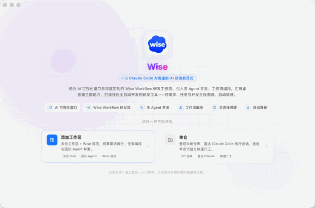
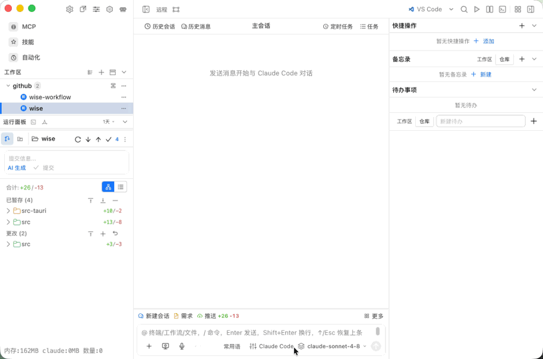
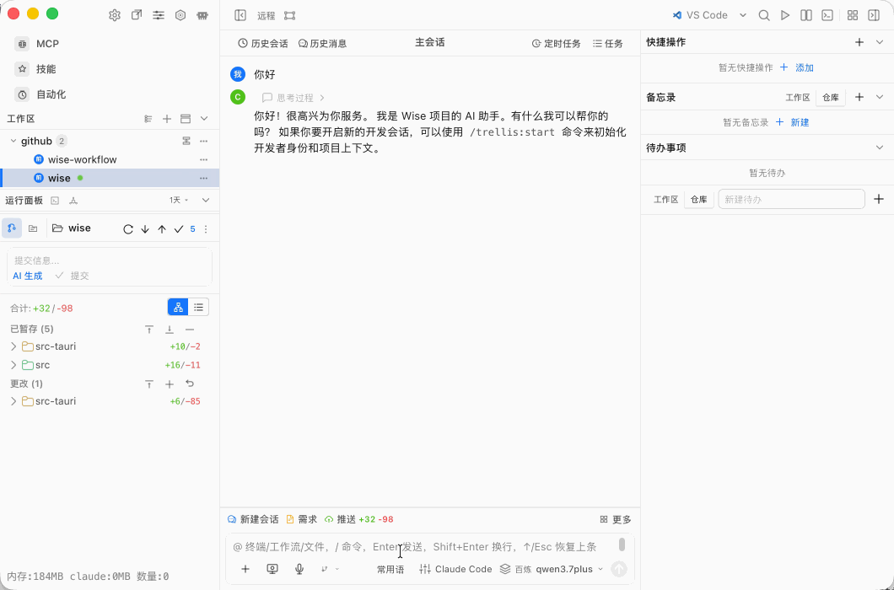

<p align="center">
  
</p>

<h1 align="center">Wise</h1>

<p align="center">
  <strong>以 Claude Code 为底座的 AI 研发新范式</strong>
</p>

<p align="center">
  <a href="README.md">中文</a> · <a href="README.en.md">English</a>
</p>

---

Wise 是一款基于 **Tauri 2** 的桌面 AI 研发工作台。它将 **Claude Code** 会话、本地 Git 仓库、可视化工作流、PRD 需求拆分、多 Agent 并发与 Mission 任务编排整合在同一窗口中，让需求、任务与代码实现全程可溯源、可编排、可自动驾驶。

<p align="center">
  
</p>

## 项目特色

| 特色 | 说明 |
|------|------|
| **AI 可视化窗口** | 桌面端 Claude Code 会话、Composer、终端与 Git 面板同屏协作 |
| **Wise Workflow 研发流** | 内置 Trellis 规范与 Mission 任务链，覆盖需求 → 拆分 → 实现 → 验收 |
| **多 Agent 并发** | 团队 Agent、子代理与 PRD 拆分 fan-out 并行派发 |
| **工作流编排** | CC Workflow Studio 可视化流程图，支持模板与阶段验收 |
| **全流程溯源** | SQLite 持久化会话、任务快照、运行记录与通知收件箱 |
| **自动驾驶** | 工作区级编排 + 执行环境配置，接近全自动的研发闭环 |

## 核心功能

- **仓库与工作区** — 支持单仓快速开工，或多仓工作区 + Wise 规范统筹研发
- **Claude Code 会话** — 创建、恢复、运行、取消会话；MCP、Hooks、Skills、Subagents 一览
- **PRD 需求拆分** — 解析 PRD/源材料，生成可执行任务树并落盘到 `.trellis/tasks/`
- **终端与 Git** — 仓库内终端、Diff、历史、分支、Worktree
- **执行环境与模型** — 配置 Claude 模型、API 与本地/远程执行环境
- **通知与监控** — 后台调用详情、团队进度与消息收件箱
- **多窗口桌面** — 主窗口 + Mascot 浮窗，共享 `~/.wise` 应用数据

## 快速开始

### 环境要求

- [Bun](https://bun.sh)（与 `package.json` 中 `packageManager` 一致，当前为 `bun@1.3.5`）
- Rust stable（Tauri 2 构建与打包）
- 各平台 Tauri 2 前置依赖（见 [Tauri 文档](https://v2.tauri.app/start/prerequisites/)）

### 安装与运行

```bash
# 安装依赖
bun install

# 开发模式（启动 Vite + Tauri 桌面窗口）
bun run tauri:dev

# 运行测试
bun test

# 生产构建
bun run build
bun run tauri:build
```

构建产物位于 `src-tauri/target/release/bundle/`。macOS 分发需 Developer ID 签名与公证；Windows 建议代码签名以减少 SmartScreen 警告。

## 使用指南

Wise 提供两种入口，可按场景选择：

| 模式 | 适用场景 |
|------|----------|
| **添加工作区** | 多仓 Hub + Wise 规范，统筹需求拆分、任务编排与团队 Agent 并发 |
| **单仓** | 登记本地 Git 仓库，直达 Claude Code 会话，适合试验与快速开工 |

### 1. 新增工作区

将多个本地仓库组成项目级工作区，启用 Mission、Trellis 规范与多 Agent 协作。

<p align="center">
  
</p>

### 2. 配置模型

在设置中心配置 Claude 模型与 API，为会话与 Agent 派发指定推理后端。

<p align="center">
  
</p>

### 3. 添加执行环境

为工作区或仓库绑定执行环境（本地 Claude Code、远程 Channel 等），让 Agent 在正确的上下文中运行。

<p align="center">
  
</p>

### 4. 运行任务

在驾驶舱中启动 Claude 会话、PRD 拆分或工作流阶段，观察多 Agent 并发执行与任务溯源。

<p align="center">
  
</p>

> 提示：已有本地目录时，从欢迎页任选入口即可；之后也可通过左侧侧栏「+」随时新建或关联仓库。

## 技术栈

| 层级 | 技术 |
|------|------|
| 桌面壳 | Tauri 2 + Rust |
| 前端 | React 19、TypeScript、Vite、Ant Design |
| 编辑器 | Monaco、Milkdown、xterm.js |
| 工作流 | CC Workflow Studio、@antv/x6 |
| 持久化 | SQLite（`~/.wise/wise.db`） |

## 数据存储

应用数据保存在 `~/.wise/`：

| 路径 | 用途 |
|------|------|
| `wise.db` | 项目、工作流、会话、Mission、任务快照 |
| `repositories.json` | 仓库侧栏注册信息 |
| `tabs.json` | 标签页会话状态 |
| `prd-images/`、`prd-runs/` | PRD 素材与拆分运行产物 |
| `composer-images/` | Composer 截图与上传图片 |

## 开发说明

- 包管理器：**仅使用 Bun**，保持 `bun.lock` 为唯一锁文件
- 编码规范：见 `.trellis/spec/`（frontend / tauri / guides）
- 大型改动前请在 `.trellis/tasks/` 创建或选择 Trellis 任务
- 推荐 IDE：VS Code + Tauri 插件 + rust-analyzer

## 许可证

请参阅仓库中的 LICENSE 文件（如有）。
