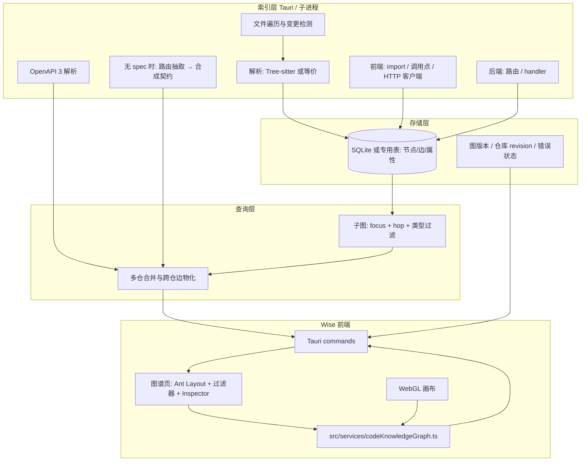

# Wise 内嵌代码知识图谱：完整可执行方案

## 1. 文档目的与读者

本文档给出在 **Wise（Tauri 2 + Bun + React 19 + TypeScript）** 中落地「单仓或多仓联合代码知识图谱」的 **可执行** 方案：范围、硬约束、架构、数据契约、与现有仓库的衔接点、分阶段任务与验收标准。

读者：实现该功能的工程师与评审者。

---

## 2. 目标与范围

### 2.1 产品目标

1. **单仓**：对单个 `Repository` 建立代码结构图（文件夹 / 文件 / 符号 / 依赖与调用等关系），在 Wise 内高性能浏览。
2. **多仓联合**：以 `Project`（`repositoryIds` 多成员）为边界，合并多个仓的图，并通过 **OpenAPI 契约** 将 **前端仓** 与 **后端仓** 的调用关系显式连成边。
3. **OpenAPI 策略**：
   - 若后端仓已有 OpenAPI 3.x 文件或可信 URL：直接解析入库，生成统一的 `ApiOperation` / `Schema` 等节点。
   - 若无：由 **Wise 自行抽取**（静态路由扫描 + 可选增强），生成 **合成 OpenAPI 子集**（或等价中间结构），再走同一套「桥接」逻辑，与前端 HTTP 调用点对齐。
4. **高性能**：支持万级边规模的 **子图查询 + WebGL 渲染 + LOD / 聚合**，避免一次性将全图载入渲染线程。

### 2.2 硬约束（必须满足）

| 编号 | 约束 |
|------|------|
| C1 | **所有图谱展示与主交互**均在 Wise 桌面应用 **前端内** 完成（独立 Tab / 面板 / 全屏视图均可），不以打开外部 GitNexus Web 作为主用户路径。 |
| C2 | React 组件 **禁止直接** `invoke`；须通过 `src/services/*` 调用 Tauri 命令或后续 HTTP 适配层（与 [CLAUDE.md](../../CLAUDE.md) 一致）。 |
| C3 | 新 UI 以 **Ant Design** 为默认（布局、表单、表格、Tabs、抽屉、反馈）；图心为 **Canvas / WebGL**，嵌在 Ant 布局内；不引入新的 UI 框架。 |
| C4 | 持久化与索引产物遵循 Wise 约定：应用数据在 **`~/.wise/`**（及现有 SQLite 演进路径），不将图索引主存放到浏览器 `localStorage`。 |
| C5 | 对外部文件、IPC、OpenAPI 文档与用户仓库内容做 **校验与降级**（解析失败可部分导入 + 明确错误状态），避免未校验 JSON 直驱 UI。 |

### 2.3 非目标（首版可不实现）

- 不承诺与 GitNexus 企业版「官方多仓 SaaS」能力逐项对齐；开源 GitNexus 以单仓 CLI + MCP 为主，**多仓联合与展示以本方案自建为准**。
- 首版不要求覆盖所有语言与框架；按优先级支持 **TypeScript/JavaScript 前端** + **常见后端框架的一组路由抽取**即可。
- 不要求首版即实现「语义级」全仓库 embedding 搜索（可作为后续阶段）。

### 2.4 参考与边界说明

- **GitNexus**：可参考其「索引 → 图 → 工具」的思路及 Tree-sitter 类解析实践；**不**将「浏览器打开 gitnexus-web」作为产品主路径。
- 若未来评估 **iframe / WebView 嵌入** 第三方图应用，须单独通过安全与体验评审；**默认实现路径** 为 Wise 原生 React + WebGL。

---

## 3. 与现有 Wise 模型的衔接

实现时应显式复用以下已有概念（避免平行一套「工作区」状态）：

| Wise 概念 | 用途 |
|-----------|------|
| `Repository`（`id`, `path`, `name`, `repositoryType`, `roleTags`） | 索引单元、节点命名空间、`repoId` 来源 |
| `Project` + `repositoryIds` | 多仓联合图的 **调度边界** |
| `resolveWorkspaceMode`（`src/utils/workspaceMode.ts`） | UI 是否展示「联合图 / 项目级」入口的 **派生依据**（`multi_repo` 等） |
| `~/.wise/`、`wise.db` | 索引版本、任务队列、图快照路径等元数据落盘 |
| `src/services/` | 所有 Tauri 调用的唯一门面 |

---

## 4. 总体架构

**要点**：

- **全量图**仅存于磁盘与查询引擎；**前端每次只请求子图**（视口 + hop + 类型过滤），满足高性能（C4、4.1）。
- **OpenAPI** 产出与代码图共享 **同一套节点类型**（`ApiOperation` 等），避免两套模型分叉。

### 4.1 高性能策略（必须在方案中落地）

| 策略 | 说明 |
|------|------|
| 子图 API | IPC 返回 `nodes[]`、`edges[]`、`stats`（总数上限、是否截断）；禁止默认返回全仓库全边。 |
| Hop 限制 | 与 GitNexus 类产品类似，支持 1–3 hop（可配置），从 `focusNodeId` 扩展。 |
| WebGL | 边数超过阈值（建议可配置，默认例如 3000）强制 WebGL 路径；低量可降级 Canvas 或保留调试模式。 |
| LOD / 聚合 | 远距离显示文件级 / 目录级聚合节点；放大后展开符号与调用边。 |
| 布局 | 重计算放在 **Worker** 或 **Rust 异步任务**，主线程只做增量更新与拾取（hit test）。 |
| 增量索引 | 文件 watcher + 内容 hash；仅失效子树重解析，写入新版本号供 UI 轮询或事件推送。 |

---

## 5. 数据契约

### 5.1 节点类型（建议枚举）

| 类型 | 说明 |
|------|------|
| `repo` | 仓库根 |
| `folder` | 目录 |
| `file` | 文件 |
| `symbol` | 类 / 函数 / 方法 / 接口等（带 `kind` 子类型） |
| `import` | 可折叠为边或弱节点（实现时二选一，需在 Schema 固定） |
| `api_operation` | method + pathTemplate + operationId（来自 OpenAPI 或合成） |
| `schema` | OAS `components.schemas` 中的模型（可选） |

### 5.2 边类型（建议枚举）

| 类型 | 说明 |
|------|------|
| `contains` | 目录 → 文件 / 文件 → 符号 |
| `imports` | 文件或符号间依赖 |
| `calls` | 调用 |
| `implements` | 实现关系（语言相关时） |
| `frontend_invokes_api` | 前端调用点 → `api_operation` |
| `backend_serves_api` | 后端路由/handler → `api_operation` |
| `cross_repo` | 可选标记或边属性 `isCrossRepo: true` |

### 5.3 稳定 ID

格式：`{repoId}:{kind}:{stableKey}`  

`stableKey` 建议：规范化相对路径 + 符号 qualified name 的哈希；**合并多仓时禁止纯自增 ID 作为主键**。

### 5.4 IPC / Service DTO（建议形状）

以下为逻辑形状，具体字段名以实现时 TypeScript 类型为准：

**请求 `get_code_graph_subgraph`**

- `projectId?: string | null`
- `repositoryIds: number[]`（单仓时一项即可）
- `focusNodeId?: string`
- `hop: 1 | 2 | 3`
- `nodeTypeFilter?: string[]`
- `includeCrossRepoEdges?: boolean`

**响应**

- `nodes: GraphNode[]`
- `edges: GraphEdge[]`
- `meta: { truncated: boolean; totalEdgeHint?: number; indexVersion: string; errors?: ParseError[] }`

**请求 `trigger_code_graph_reindex`**

- `repositoryId: number` 或 `projectId` + `repositoryIds`

校验：所有数组长度上限、字符串长度上限在 Rust 侧拒绝并返回可读错误码。

---

## 6. OpenAPI 桥接（前后端联合）

### 6.1 有 OpenAPI 时

1. 在 **Project 或 Repository 元数据**（可存 DB 或 `~/.wise` 下 JSON，与现有 `repositories` 配置策略一致）中配置：`openapiPath`（相对仓库根）或 `openapiUrl`。
2. 解析 **OpenAPI 3.0/3.1**（选用成熟 crate 或 TS 侧预解析 + 存中间结果；**推荐 Rust 侧统一解析** 减少双份逻辑）。
3. 生成 `api_operation`（及可选 `schema`）节点；记录 `source: openapi` 与文件路径便于 Inspector 跳转。

### 6.2 无 OpenAPI 时（Wise 抽取）

**最小可行（MVP）**：

1. **后端路由抽取**：按框架插件化（首版选 1～2 个框架，如 Express/FastAPI），输出 `(method, pathTemplate, fileSpan)` 列表。
2. **前端 HTTP 调用抽取**：识别 `fetch`、`axios`、`ofetch` 等常见模式的 **静态字符串 URL** 与 method；将 path 与 `pathTemplate` 做 **归一化匹配**（含 `:id` / `{id}`）。
3. 合成 **仅含 paths** 的中间结构（可序列化为「瘦 OpenAPI」JSON 存盘），与 6.1 共用后续边生成逻辑。

**增强（后续迭代）**：测试代码中的 URL、网关前缀配置、多环境 baseURL 表。

### 6.3 跨仓边生成规则

仅在同一 `Project` 下：

- `repositoryType`（或 `roleTags`）含 frontend 的仓 → 含 backend 的仓；
- `api_operation` 已物化；
- 字符串匹配或规范化匹配成功则创建 `frontend_invokes_api`；后端 handler 对齐则创建 `backend_serves_api`。

冲突策略（须写清）：同一 operation 多候选 handler 时 **全部保留并标记 `ambiguous: true`**，UI 用 Inspector 列出证据。

---

## 7. Wise 前端落地结构（建议路径）

以下路径为 **建议**，实施时可微调，但需保持分层：

| 路径 | 职责 |
|------|------|
| `src/services/codeKnowledgeGraph.ts` | `getSubgraph`、`reindex`、`getIndexStatus`；封装 `invoke` |
| `src/types/codeKnowledgeGraph.ts` 或 `src/types.ts` 扩展 | DTO 与枚举 |
| `src/components/CodeKnowledgeGraph/` | 页面壳：Ant Layout、过滤器、状态栏、错误提示 |
| `src/components/CodeKnowledgeGraph/GraphCanvas.tsx` | WebGL / 控制器封装 |
| `src/components/CodeKnowledgeGraph/InspectorPanel.tsx` | 代码片段 / OpenAPI 片段 / 元数据 |
| `src-tauri/src/code_knowledge_graph.rs`（或子模块目录） | 索引、存储、子图查询命令注册 |
| `src-tauri/src/lib.rs` | **仅注册命令**，业务不堆叠进 `lib.rs`（与 CLAUDE 指引一致） |

**入口**：在 `AppImpl.tsx` 或现有主导航中增加「代码图谱」入口；`multi_repo` 时默认 `projectId` 为当前 `activeProjectId`。

---

## 8. Rust / 存储实施要点

1. **迁移**：在 `wise_db.rs` 或独立 migration 中增加图相关表（节点、边、索引版本、每仓 cursor）。
2. **命令命名**：与现有 Tauri 命令风格一致（snake_case）；能力边界在 `capabilities/default.json` 中显式声明。
3. **大仓库**：索引在 **spawn_blocking** 或 **子进程** 中执行，避免阻塞主线程；进度通过 channel 或轮询状态命令暴露给 UI。
4. **安全**：所有路径必须限制在 **已登记 Repository 的根路径** 内，拒绝 `..` 逃逸。

---

## 9. 分阶段交付与验收

### Phase 0：契约与空壳

**交付物**：`GraphNode` / `GraphEdge` TypeScript 类型；Rust 侧空实现或 fixture 返回；`src/services` 封装；Ant 占位页「无数据 / 加载中」。

**验收**：从 Wise 内打开图谱页，不崩溃；无索引时有明确文案与「重建索引」按钮（可 noop）。

### Phase 1：单仓索引与子图

**交付物**：单语言（建议 TS）文件级 + 符号级基础图；`get_subgraph` 实现 hop 与类型过滤；Inspector 显示文件路径与行号范围。

**验收**：中型单仓（例如 &lt; 5k 文件）索引完成；子图请求在本地 SSD 上 **P95 &lt; 200ms**（以开发机为基准写入 RUNBOOK）。

### Phase 2：Wise 内 WebGL 与性能

**交付物**：WebGL 渲染路径；边数超阈值自动启用；LOD / 聚合最小版本；布局非主线程。

**验收**：**在 Wise 内** 对 ≥1 万边的 **子图**（非全图）平移缩放可交互；CPU 占用可控（具体 FPS 目标由团队定义，建议 ≥30fps 于中等机器）。

### Phase 3：OpenAPI 导入与桥接边

**交付物**：配置 OpenAPI 路径；`api_operation` 节点；`frontend_invokes_api` / `backend_serves_api` 边。

**验收**：同一 Project 下前后端各一仓样例工程，图谱中可见跨仓连线；Inspector 可跳转 OpenAPI 片段与源码。

### Phase 4：无 OpenAPI 抽取与多仓默认路径

**交付物**：合成契约；`Project` 多成员默认联合查询；错误与部分成功状态完整。

**验收**：无 yaml 后端样例仍能生成与前端对齐的边；`multi_repo` 切换焦点不丢状态或行为有文档说明。

### Phase 5（可选）：对外 HTTP OpenAPI

**交付物**：本地 HTTP（或插件协议）暴露只读子图与索引状态，**OpenAPI 文档描述该 HTTP**；Wise 前端仍优先 IPC。

**验收**：第三方可用生成客户端拉取子图；权限与绑定地址默认 localhost。

---

## 10. 测试与质量门禁

| 类型 | 内容 |
|------|------|
| 单元测试 | 路径归一化、OpenAPI 片段解析、子图 hop 算法、稳定 ID 生成 |
| 集成测试 | 小 fixture 仓库 + 预期边集合（Rust 或脚本生成 golden） |
| 前端 | 组件测可选；**禁止**为图谱页默认启动重型 dev server；以 `bun test` 与类型检查为主（遵守仓库对 agent 的约定时由执行者判断） |

---

## 11. 风险登记与缓解

| 风险 | 缓解 |
|------|------|
| 解析内存与时间过长 | 子进程、分块索引、可取消任务 |
| 前端调用无法静态解析 | UI 标明「未解析」；允许手动绑定 operation（后续） |
| 多候选 handler | `ambiguous` 标记 + Inspector 证据列表 |
| 与 GitNexus 功能预期混淆 | 对外说明：本功能为 Wise 自建；参考 GitNexus 思路而非依赖其 Web 产品闭环 |

---

## 12. 文档维护

- 实现过程中若有 **IPC 字段或表结构** 变更，应同步更新本文档「§5 数据契约」或追加 `CHANGELOG` 小节。
- 若引入新的开发者操作命令，在仓库根 `RUNBOOK` 类文档中增加索引命令（若项目尚无统一 RUNBOOK，可仅在 `.trellis/workspace` 或 CLAUDE 补充一句指向本目录）。

---

**版本**：1.0  
**状态**：可执行草案（待 Phase 0 开工后迭代修订）
