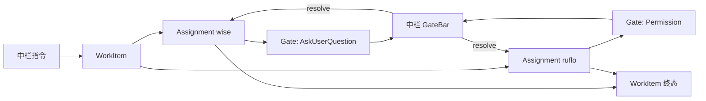

# 指挥台架构（v3 定稿）

> **状态**：设计定稿，待宪法同步与分周实施。  
> **目标**：让「左选、中派、右看、下跑、上答」在现有 Wise 代码上可渐进落地。

---

## 0. 设计原则（落地约束）

| 原则 | 含义 |
|------|------|
| **不新建平行宇宙** | 工作项 ≈ `mission_runs`；关口 ≈ `notificationHub` 升格；事件 ≈ `trellis_runtime_events` 扩展 |
| **先接管线，再换 UI** | 第一周只改数据流，中栏视觉可几乎不变 |
| **一个焦点** | 全应用只有一个 `FocusContext`，三栏联动 |
| **阻塞与非阻塞分流** | 需人介入 → 中栏 GateBar；仅进展 → 右栏 + 轻通知 |
| **兼容旧路径** | 仓库 Chat、Mission 画布在迁移期保留，经 `inspect` 叠层进入 |

---

## 1. 一句话定位

Wise 三栏分工：

- **左栏**：我在管什么（Workspace / 项目 / 仓库索引）
- **中栏**：我要做什么（持久指挥台，只派发与决策）
- **右栏**：做得怎么样（跟随焦点的执行透镜与快捷配置）

与 Devin / Cursor Background Agent / LangGraph Supervisor 同向：**一个协调者 + 多个 Worker + 结构化人机中断**，而非 N 个平行 Chat 各问各的。

---

## 2. 核心概念（三个）

```
工作项 WorkItem     = 中栏下达的一次意图（≈ mission_runs 或轻量 dispatch）
执行单元 Assignment = 某仓库/Agent 上的具体执行（≈ mission_agent_assignments）
关口 Gate           = 执行层需用户介入的中断（Question / Permission / Blocker）
```



### 与主流方案对齐

| 主流 | Wise 映射 |
|------|-----------|
| LangGraph `thread_id` | `mission_id` / `correlationId` |
| LangGraph `interrupt()` | Gate 创建 + Assignment `waiting_gate` |
| Slack Thread | WorkItem 内 Assignment + Gate 时间线 |
| K8s Condition | Assignment `status` + 左栏徽章 |
| Linear Inbox | GateBar（阻塞）vs WorkItemFeed / 右栏（非阻塞） |

---

## 3. 全局焦点：FocusContext

三栏不通畅的根因是选中态分散。v3 用单一焦点驱动三栏：

```ts
type FocusContext =
  | { level: "command" }
  | { level: "workspace"; projectId?: string; repoId?: number }
  | { level: "work-item"; missionId: string }
  | { level: "gate"; gateId: string }
  | { level: "assignment"; assignmentId: string };
```

| 用户动作 | FocusContext | 三栏响应 |
|----------|--------------|----------|
| 打开应用 | `command` | 中栏：GateBar + WorkItemFeed；右栏：团队概览 |
| 左栏点项目 | `workspace(projectId)` | 右栏：该项目 WorkItem + Agent 树 |
| 中栏点工作项 | `work-item(missionId)` | 右栏：Mission 执行详情 |
| 中栏答关口 | `gate(gateId)` | 右栏：定位来源 Assignment 的 stdout |
| 右栏点 Agent | `assignment(assignmentId)` | 右栏展开详情；中栏高亮对应 WorkItem |

**实施**：`src/hooks/useFocusContext.ts` + Context Provider；渐进替换 `AppImpl` 中分散的选中态。

---

## 4. 三栏职责

### 4.1 左栏 · 索引（Index）

只做导航与摘要，不做答题、不看 diff。

```
工作区
├─ WISE 8          ⚡1  ▶2
│  ├─ wise         ⚡1
│  └─ ruflo        ▶1
├─ 华润 2          ✓
└─ + 单仓
```

徽章（从 Gate + Assignment 聚合）：

- ⚡ = 该节点下有 `pending` Gate
- ▶ = 有 `running` Assignment

### 4.2 中栏 · 指挥台（Command Surface）

固定三区，自上而下：

```
┌─ ① WorkItemFeed（主区可滚动）─────────────────────────────────┤
│  ▶ #42 拆分 PRD · 3 仓 · 待答 1 · 2m                         │
│  ▶ #41 修 login · running · wise                               │
│  ✓ #40 更新 README · 5m                                      │
├─ ② GateBar（待你确认，有 pending 时展开）──────────────────────┤
│  [wise/前端] 是否继续重构 auth？  [继续] [跳过] [改派]        │
├─ ③ CommandBar（底栏固定）─────────────────────────────────────┤
│  @wise @ruflo  给两个仓加 rate limit...            [派发]    │
└─ 状态条：并发 3/16 · 待答 1 · 今日完成 7 ─────────────────────┘
```

规则：

1. **WorkItemFeed 置顶** — 全局进度一览，占主视觉区
2. **GateBar 居中偏下** — 待确认关口紧邻输入区，答完即续跑；有 pending 时展开
3. **CommandBar 固定底栏** — 类似 Chat 输入，随时可派发
4. **深度 Chat / Mission 画布** — `inspect` 叠层，不占中栏默认态

### 4.3 右栏 · 透镜（Lens）

由 `FocusContext` 决定内容；**不提供答题主入口**（仅「在中栏处理 ↑」）。

| FocusContext | 右栏内容 |
|--------------|----------|
| `command` | 团队并发、资源、最近 Git 摘要 |
| `workspace` | 该工作区 WorkItem 列表 + 仓库成员树 |
| `work-item` | Mission stepper + Assignment 列表 + 关键 stdout |
| `gate` | 题干、相关 diff、Agent 输出片段、改派 |
| `assignment` | 完整 stdout/stderr + Git diff + 证据 |

---

## 5. 端到端主路径

### A. 单仓快速派发

```
CommandBar: @wise 修 login 超时
  → planAtMentionDispatch / dispatchIntent
  → WorkItem (mission_runs, stage=direct) + 1 Assignment
  → executeClaudeCode
  → AskUserQuestion → gateHub.ingest → GateBar
  → 用户答题 → gateHub.resolve → stdin 续跑
  → Assignment succeeded → WorkItemFeed ✓
```

### B. 跨仓 PRD 拆分

```
/prd-split 或助手入口
  → WorkItem (stage=splitting)
  → inspect: PrdTaskSplitPanel（不占中栏）
  → 多 Assignment 并行
  → 任一出 Gate → GateBar（标签 wise/ruflo）
  → 中栏答 → 对应 Assignment resume
```

### C. 并发多 Gate

- GateBar FIFO 队列，可手动置顶
- 同 repo、同 tool 的 Permission 支持「批量批准本组」
- 答完自动 focus 下一 `gateId`

### D. 失败与改派

```
Assignment failed
  → WorkItem = blocked（非直接 failed）
  → GateBar Blocker：重跑 / 改派 / 跳过
  → 改派 → 新 Assignment，同一 mission_id
```

---

## 6. 回传总线：gateHub

执行层不直接面向 UI，统一经 **gateHub**（薄封装 `notificationHub`）：

```
执行层 (repo/session)
    │ trellis_runtime_record_event（审计：gate.opened / gate.resolved）
    ▼
gateHub（全局）
    ├─ pending → GateBar
    ├─ 绑定 missionId / assignmentId
    └─ resolve → notificationHub + Assignment status → Worker resume
```

**Progress** 走现有 `useMonitorOverview` / stdout，**不**写入 runtime_events 表（避免膨胀）。

**Question 去重**：同 assignment 同题干不重复入队。  
**Stale**：进程结束 → `invalidateControlRequestsForSession`（已有）→ Gate `expired`。

---

## 7. 数据层（扩展现有表）

### 7.1 WorkItem ≈ mission_runs

```sql
ALTER TABLE mission_runs ADD COLUMN intent_text TEXT;
ALTER TABLE mission_runs ADD COLUMN focus_correlation_id TEXT;
```

轻量派发可 `mission_id = correlationId`；列表按 `updated_at DESC`。

### 7.2 Assignment 状态

在现有 `status` 上增加生命周期（向后兼容）：

```
pending → running → waiting_gate → running → succeeded | failed | cancelled
```

`waiting_gate` 在 Gate 创建/resolve 时经 `mission_upsert_agent_assignment` 写入。

### 7.3 Runtime 审计事件（仅 3 种）

| eventKind | 用途 |
|-----------|------|
| `gate.opened` | Gate 创建 |
| `gate.resolved` | 用户回答 |
| `work-item.closed` | WorkItem 终态 |

---

## 8. ViewMode 收敛

迁移完成后：

```ts
type ViewMode =
  | { kind: "command" }                    // 默认：三栏指挥台
  | { kind: "author"; pane: AuthorPane }
  | { kind: "inspect"; tool: InspectTool; missionId?: string; sessionId?: string };
```

去掉 `chat` ↔ `cockpit` 互斥；Chat 沉浸 = `inspect.session`，Mission 画布 = `inspect.mission`。

---

## 9. 与宪法（agent-harness-architecture）的差异与同步项

| 宪法现状 | 本方案 | 同步动作 |
|----------|--------|----------|
| 默认主屏 Chat（2026-05-18 修订） | 默认 Command Surface + WorkItemFeed | 修订 §4，中栏指挥台为 Operator 默认 |
| Cockpit 三栏含 Mission 主画布 | Mission 画布 → `inspect.mission` | 修订 §4.1–§4.4 |
| Inspector 跟随 Cockpit 点击 | Inspector 跟随 FocusContext | 修订 §4.2 |
| Standalone 仅 Chat | Standalone 可派发 WorkItem，无 Mission 画布 | 修订 §6 产品规则 |

---

## 10. 体验细则

### 10.1 注意力

- 有 pending Gate → GateBar 展开 + 轻高亮（非 modal）
- 无 pending → GateBar 折叠为「无待办 ✓」
- 用户正在 CommandBar 输入 → GateBar 不抢焦点

### 10.2 答完流转

`resolve` → 若有下一 Gate 则 `focusGate(next)` → 否则回到 `work-item` 或 `command`。

### 10.3 深聊

WorkItem「打开会话」→ `inspect.session`；**左栏 + GateBar + WorkItemFeed 保持可见**；新 Gate 仍只出现在 GateBar。

### 10.4 Standalone

- 仅 1 Assignment，无 Mission 画布
- Workspace 可多 Assignment + PRD Split
- 升格 Workspace：补写 `mission_runs.project_id` 即可

---

## 11. 模块映射（摘要）

| 模块 | 动作 |
|------|------|
| `AppImpl.tsx` | `useFocusContext` + `gateHub` 订阅 |
| `AppWorkspaceLayout.tsx` | 中栏 `CommandSurface` |
| `ClaudeSessions` | 降级为 `inspect.session` |
| `MissionControl` | 降级为 `inspect.mission` |
| `notificationHub` | 内核不动；`gateHub` 适配 |
| `ChatInspector` | → `LensPanel`（FocusContext 分支） |
| `atMentionDispatch` | 挂钩 `dispatchIntent` → WorkItem |
| `useViewMode` | 收敛为 `command \| author \| inspect` |

详见 [EXECUTION-PLAN.md](./EXECUTION-PLAN.md)。

---

## 12. 反模式（实施时避免）

1. 在右栏或仓库 Chat 内再建一套「待答题」主入口  
2. 为 WorkItem 新建与 `mission_runs` 平行的 Thread 表（第一版禁止）  
3. 把所有 stdout 片段写入 `trellis_runtime_events`  
4. 一次性删除 Chat 主屏（须等 GateBar + WorkItemFeed 验收后再切默认 ViewMode）  
5. Gate 与 session 脱钩（每个 Gate 必须可反查 `assignmentId` / `missionId`）
