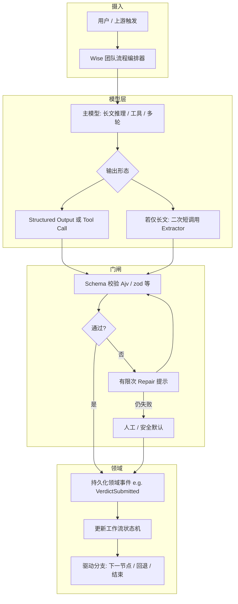

# LLM 产出 → 业务分支：稳妥编排方案

本文描述业界常见做法，用于「模型处理后的结果如何进入逻辑分支判断」，不绑定具体仓库实现。可与现有「团队流程 / 验收节点 / Claude Code 会话」对照演进。

**可执行落地（Wise 分阶段任务 / 验收 / DoD）**：见同目录 **[EXECUTION-PLAN.md](./EXECUTION-PLAN.md)**。  
**并行开发拆解（工时 / 依赖 / 合并顺序）**：见同目录 **[TASK-BREAKDOWN.md](./TASK-BREAKDOWN.md)**。  
**手工回归脚本（团队流程编排融合）**：见同目录 **[manual-test-script.md](./manual-test-script.md)**。

### Wise 仓库：本方案与代码的关系

- **本文默认主路径**：按架构图优先走 **Structured Output / Tool Call（D1）**，再过 schema 门闸并事件化落库；这是本文推荐且应优先实现的方案。
- **当前代码状态**：团队任务执行链已具备事件化、门闸与幂等；但在尚未全面接入 Tool/Structured Output 的节点，仍保留兼容解析路径。
- **迁移原则**：新接入或重构验收节点时，优先把输出从“自由文本”收敛到 **Tool 参数或约束结构化输出**；文本推断仅作为兜底与过渡，不作为长期主路径。

---

## 1. 问题陈述

- **自然语言长文**不适合作为唯一分支依据：解析脆弱、顺序歧义（先举例后结论）、长度与围栏截断。
- **目标**：分支判断依赖 **可验证、可版本化、可观测** 的契约；失败行为 **可预测**（重试、人工、安全默认）。

---

## 2. 设计原则（业界共识）

1. **Decider 与 Proposer 分离**：模型提议；**系统**在校验通过后才是唯一写状态的一方。
2. **契约优于启发式**：优先 JSON Schema / tool 参数，而非无限放大正则与尾窗。
3. **单写者状态**：工作流阶段、通过/驳回等 **由引擎或 DB 单点提交**，避免「从会话最后一条消息反推」作为主路径。
4. **可观测**：保留 completion 标识、schema 版本、校验错误、最终采纳的 payload 哈希或摘要。
5. **有限自动修复**：解析失败允许 **固定次数** 的 repair；超过则 **人工或安全默认**，而非无限放宽解析。

---

## 3. 推荐架构（总览）

以下将 **「分析长文」** 与 **「产生机器可读决策」** 解耦；分支只依赖后者。



**要点**：

- **K（分支）** 只读 **I 之后** 已提交的快照，不直接读「会话里最后几 KB 文本」。
- **D1（Structured Output / Tool Call）是默认主路径**：分支决策优先依赖 tool 参数或强约束结构化输出，而不是正文解析。
- **D2** 仅在当前链路无法直接接 Tool/Structured Output 时作为过渡兜底。

---

## 4. 方案分层（怎么选）

| 层级 | 做法 | 稳妥性 | 说明 |
|------|------|--------|------|
| A | **约束 JSON**（JSON Schema + 服务端校验 + schema 版本） | 高 | 与「JSON mode / structured output / guided decoding」配套最佳 |
| B | **Function / tool calling** | 很高 | 决策即 RPC 参数，几乎不经过自由文本解析 |
| C | **状态外置 + 事件溯源** | 很高 | 刷新、重放、并发下仍一致；LLM 只产事件 payload |
| D | **二次短调用 Extractor** | 中高 | 主回复长、弱约束时的折中 |
| E | **纯启发式**（正则、尾窗） | 低 | 仅适合展示或软提示，不宜单独驱动强状态机 |

**组合推荐（默认）**：**B（Tool Calling）+ C（事件溯源）**；若受限则 **A + C**；**D** 仅作过渡兜底；避免单独 **E** 驱动关键分支。

---

## 5. 契约示例（验收 / 通过驳回）

**最小字段**（示例名，可按域模型调整）：

```json
{
  "schemaVersion": 1,
  "workflowAcceptanceVerdict": "approve",
  "taskRef": { "taskId": "…", "nodeId": "…" },
  "rationale": "可选，一句人话",
  "evidenceRefs": ["可选: 消息 id / 文件路径 / url"]
}
```

- **分支**只读 `workflowAcceptanceVerdict`（或映射后的枚举）与 `taskRef` 一致性。
- **schemaVersion** 便于演进与兼容旧事件。

---

## 6. 失败与并发（业界必提）

- **幂等**：同一 `taskId + attemptId` 重复提交 verdict → 相同结果不二次推进。
- **乐观锁 / 版本号**：防止两路同时写状态。
- **超时**：模型未在时限内产出合法 payload → **待人工** 或 **安全默认**（如不自动通过）。

---

## 7. 与「Claude Code 会话 + 团队流程」的落点（概念对齐）

| 当前常见形态 | 演进方向 |
|--------------|----------|
| 从助手整段 markdown 解析 JSON | 默认改为 **Tool Call**；其次使用 **Structured Output + schema 校验**；解析与分支在服务端/宿主门闸完成 |
| 完成一轮即推断验收 | 完成一轮 → **写入事件队列** → 校验 → **再** `advance` |
| 依赖会话内最后一条文本 | **状态与事件** 为源；会话仅作审计展示 |

---

## 8. 演进路径（建议顺序）

1. 固定 **schemaVersion + 枚举 verdict**，服务端强校验。
2. **优先接 Tool Call（默认）**；若受限则接 Structured Output；仍受限再用二次短调用 Extractor。
3. 工作流推进改为 **事件驱动**（至少「先落库/落事件再改 UI」）。
4. 收紧 **启发式** 为兜底或仅日志提示，不作为唯一真源。

---

## 9. 文档维护

- 本目录：`design/llm-structured-decision-pipeline/`
- 与现有工作流契约文档可交叉引用：`design/workflow/workflow-event-contract.md` 等（若后续在代码里落地事件名，再同步更新即可）。
- **Wise 代码映射（验收新方案）**：助手输出经 **`acceptanceVerdict.ts`** 统一解析后驱动 verdict 事件与 `decide` 门闸；`src/services/workflowGraphRuntime.ts` 负责图运行时与 `composeDispatchInput` 派发模板，并对 verdict 相关符号 **re-export** 以保持兼容 import（细节见 `EXECUTION-PLAN.md` 映射表）。
