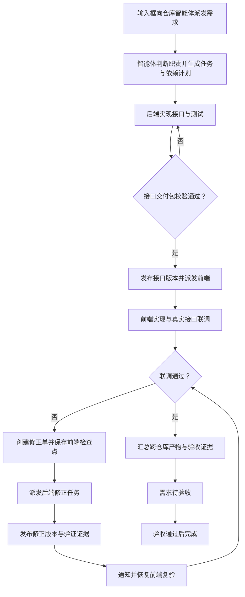

# 多仓库需求协作与项目知识互通方案

状态：首期（M0～M3）已实现，AC-01～AC-40 的验收证据见 [技术设计 §11](./TECHNICAL-DESIGN.md#11-首期实现与验收记录)；M4 增强未开始。日期：2026-09-24。

## 1. 产品目标

用户可以为单个或多个仓库配置一个长期负责的智能体，在会话输入框直接向它派发业务需求。智能体根据绑定仓库、独立配置与代码上下文，自行判断前后端职责、拆分任务、安排依赖，并在项目之间传递接口、知识与交付物。联调问题自动交给后端修正，修正后通知和恢复前端复验，最终由主责智能体汇总验收。原有手工创建需求、选择仓库和调整计划的入口继续保留。

核心模型：**仓库智能体及独立配置 + 会话派发入口 + 一个需求 + 多个仓库任务 + 版本化共享资源 + 持久协作消息 + 依赖调度**。

默认采用“后端接口可用后，前端开始”的串行方式。只有用户选择“允许基于契约并行”时，前端才能提前使用 Mock 开发；真实接口联调仍是完成条件。

产品规则：沿用现有项目、仓库、会话与执行能力；通过 Hub / Channel / Automation / Artifact 承载新增能力，内置界面使用中文。

文档导航：本页定义目标与功能；[交互、决策与运行规则](./OPERATING-SPEC.md) 说明用户操作、默认行为和完整示例；[技术设计与实施计划](./TECHNICAL-DESIGN.md) 定义数据与实现边界。三份文档共同组成首期方案，首期已按此实现。

## 2. 当前基础与缺口

以下结论依据本次本地代码检查；已有设计文档不等同于已实现能力。

| 当前基础 | 依据 | 本方案需要补足 |
| --- | --- | --- |
| 项目已经支持关联多个仓库 | `src/types.ts` 的 `ProjectItem.repositoryIds`；`src/services/projectState.ts` | 需求同时关联多个项目与仓库，明确每个仓库责任 |
| 需求只绑定一个 `repositoryId`，状态为 open / verifying / done | `src/types/workspaceRequirements.ts` | 仓库任务、依赖条件、修正单与聚合进度 |
| 需求整体存于 app_settings 的 V1 JSON | `src/services/workspaceRequirementsStore.ts` | 可事务更新的协作数据和版本冲突控制 |
| 自动派发由前端 Hook 扫描需求、控制并发和重试 | `src/hooks/useWorkspaceRequirementAutoDispatch.ts` | 持久调度、按依赖放行、重启恢复、多窗口防重 |
| 执行环境派发能创建多个会话，但使用主会话仓库路径 | `src/services/executionEnvironmentDispatch.ts` | 每个任务独立绑定仓库、运行环境、分支与会话 |
| 反馈分析可创建 worker 并监听结束；记录使用内存 Map | `src/services/sessionFeedbackLoopDispatch.ts`；`src/stores/sessionFeedbackLoopDispatchStore.ts` | 跨仓库持久收件箱、修正责任人、交付校验与可靠恢复 |
| 已有需求逐轮执行、人工验收日志 | `src-tauri/src/requirement_execution_records.rs` | 按任务、尝试、修正轮次追加关联，保留原历史 |
| 知识节点主要生成“当前工作区检索”的提示内容 | `src/services/workflowKnowledgeRetrieval.ts` | 显式跨项目授权、资源版本、来源引用和共享检索 |
| 产物面板支持仓库文件及运行预览 | `src/components/ArtifactsPanel/index.tsx` | 跨仓库交付清单、契约版本与联调证据聚合 |
| 助手已有身份、模型、入口及 Skill/MCP 引用，支持助手/项目/仓库覆盖 | `src/types/assistant.ts`；`src-tauri/src/assistants/runtime_resolver.rs` | 持久仓库绑定、独立 SOUL/AGENTS.md、知识与记忆命名空间、配置快照和能力隔离 |
| 已有会话 @ 仓库/角色解析及助手启动路径 | `src/services/atMentionDispatch.ts`；`src/services/assistantTemplateActivation.ts` | 输入框明确选择智能体，创建持久需求并自主规划，保持原会话的进度关联 |

历史 `mission_*`、Trellis/PRD 表已在 migration 043 中删除，不能将旧方案中的这些表视为可直接复用的运行基础。本方案新增协作模型，不删除当前后端命令、数据或集成路径。

## 3. 用户场景与范围

### 3.1 首期必须支持

1. 同一项目下，订单后端、管理前端、移动端三个仓库实现同一个需求。
2. 业务项目引用账号平台项目的接口和领域知识，必要时将修正任务派到账号平台仓库。
3. 后端先完成接口与可用环境，前端再开始实现并联调；缺字段、类型错误、鉴权约定不一致都能形成反馈闭环。
4. 前端等待期间释放执行槽位；修正完成后恢复原会话，原会话失效时携带检查点创建新会话。
5. 重启应用后恢复需求进度、未读消息和待执行任务，不重复创建同一修正任务。
6. 为一个仓库配置专属智能体，或为前后端等多个仓库配置同一个智能体；各智能体拥有独立 SOUL、AGENTS.md、知识、记忆、Skill 和 MCP。
7. 在输入框向“订单研发智能体”发送“实现订单优惠展示”，无需手工选择前后端或拆任务，智能体自行规划、派发、联调和汇总。

### 3.2 默认边界

- 首期运行在一个 Wise 实例管理的多个本地仓库，项目间共享和后端→前端闭环都必须交付。
- 数据模型保留远程运行目标，后续接入远程 Agent；远程机器的文件传输、环境可达性和跨设备同步单独验收。
- 不要求把多个仓库放进一个 Git 仓库，也不要求一个 Agent 同时写多个仓库。
- 开始协作即允许在已选仓库和执行权限范围内自动派发、修正与恢复；增加仓库、扩大权限、修改业务范围时才进入待决策。
- 需求完成代表实现和验收完成；跨仓库合并、发布、部署使用独立策略，不因为 Agent 说“完成”自动执行。
- 首期不引入向量数据库、跨组织账号体系或自动合并知识冲突；这些不影响按资源引用和关键词检索实现互通。

## 4. 核心概念

| 概念 | 用户意义 | 必须记录 |
| --- | --- | --- |
| 协作空间 | 多个项目共同使用的一组资源与协作规则；从项目的“协作与共享”进入 | 成员项目、共享授权、默认派发策略 |
| 仓库智能体 | 长期负责单仓库或多仓库业务的可派发对象 | 稳定身份、绑定仓库、职责、独立配置版本、记忆空间、执行策略 |
| 智能体配置 | 定义该智能体如何工作及可用能力 | SOUL、AGENTS.md、知识引用、记忆策略、Skill、MCP、引擎与模型 |
| 需求 | 一个业务目标、统一验收入口 | 主责项目、参与项目、范围版本、验收条件、执行计划 |
| 仓库任务 | 在一个仓库内完成一份职责 | 所属项目与仓库、Agent、环境、输入、输出、依赖、检查点 |
| 依赖条件 | 决定任务何时能启动或恢复 | 上游交付、要求版本、检验条件、受影响任务 |
| 接口交付包 | 后端交给前端的可验证成果 | 契约、实现版本、环境、用例和测试结果 |
| 修正单 | 联调问题及其处理闭环 | 问题证据、责任任务、消费方、期望结果、修正轮次 |
| 共享资源 | 可跨项目复用的资料 | 来源、版本、维护者、可见范围、引用记录 |
| 协作消息 | 给任务或 Agent 的可追踪交接 | 发送方、接收任务、关联交付/修正单、送达与处理状态 |

一个仓库可以属于多个项目；需求里仍须明确任务的责任项目。加入协作空间仅建立协作关系，不自动授予全部项目文件的读取或修改权限。

### 4.1 仓库智能体与绑定（MR-09）

智能体是可重复接收需求的持久身份，会话是它的一次工作载体。用户在 Hub 的“助手”内创建仓库智能体，也可从仓库设置中创建或绑定；不新增另一套独立助手入口。

- **单仓库智能体**：如“订单后端”，负责 order-api。
- **多仓库智能体**：如“订单研发”，同时负责 order-api、admin-web、mobile-web，允许跨已加入协作范围的项目绑定。
- 一个仓库可以关联研发、测试、文档等多个智能体；每个项目内的仓库最多设置一个默认负责智能体。默认绑定不覆盖用户明确选择。
- 每个绑定记录责任项目、仓库、职责、读写范围和可选的仓库专用配置。未设置专用项时使用该智能体基础配置，不自动采用其他智能体的配置。
- 一个需求只有一个主责智能体。同一个多仓库智能体可以以自己的身份执行不同仓库任务，也可按配置委派给专业智能体；用户无须为了前后端各自创建智能体。

### 4.2 六类独立配置（MR-10）

| 配置项 | 内容与作用 | 隔离及复用规则 |
| --- | --- | --- |
| 灵魂设定（SOUL.md） | 身份、目标、工作风格、判断原则 | 每个智能体独立编辑与版本化，可从模板创建 |
| 工作规则（AGENTS.md） | 操作步骤、代码规范、测试、协作与交付要求 | 智能体自有规则独立保存；同时遵守目标仓库及目录中适用的规则 |
| 知识 | 文档、架构、接口、领域资料、共享资源订阅 | 私有知识独立管理；跨智能体/项目复用通过显式引用和授权 |
| 记忆 | 用户偏好、已验证经验、历史决策及其来源 | 默认仅该智能体可用，区分通用与仓库范围；支持查看、修订、删除和清空 |
| Skill | 启用技能、固定版本、参数、按仓库适用范围 | 从现有技能 Hub 选择，每个智能体独立启停；共享安装包不等于共享配置 |
| MCP | 服务连接、工具范围、凭据引用 | 从现有 MCP Hub 绑定，每个智能体独立启停及工具授权，不向其他智能体暴露凭据 |

六项均支持独立维护、导入或引用已有文件；界面展示编辑版本与实际生效配置。允许某项为空，首次创建可从选定模板复制，后续修改互不影响。模板升级仅提示更新，不静默覆盖已有智能体。

同一智能体可对不同仓库设置专用规则、知识、技能和 MCP；界面明确标识“继承 / 仓库专用 / 已禁用”。智能体 SOUL/AGENTS.md 默认存于 Wise 管理的配置目录，不能因绑定仓库就覆写仓库已有文件。

配置在需求开始时锁定，重试与恢复默认使用该版本。用户可为后续尝试显式升级并查看影响；权限撤销与工具禁用即时生效，不能因锁定旧版本继续使用。记忆提供上下文，不能覆盖当前需求、仓库规则或接口契约；失败猜测不能自动沉淀为已验证知识。

配置支持草稿、发布、版本比较和回退；回退生成新版本。必需能力缺失阻塞相应执行，可选能力不可用时显式降级。启用、停用、归档与更换负责人见配套运行规则，六类配置允许按需为空，不要求首次创建时全部填写。

### 4.3 会话输入框派发（MR-11）

输入框增加接收者选择，支持选择智能体或输入 `@订单研发`。选中后显示智能体、覆盖仓库与当前模式；发送传递稳定智能体 ID，不能仅凭名称路由。

```text
接收者：订单研发  ·  order-api / admin-web / mobile-web
模式：执行需求
@订单研发 实现订单详情优惠金额展示，管理端和移动端都需要。
[发送并执行]
```

输入框有三种明确模式：“讨论”只分析答疑，“先规划”生成待启动计划，“执行需求”发送即创建或绑定持久需求并自动启动有效计划，无需再打开需求表单或逐步确认分工。原会话返回需求卡片，持续显示判断依据、涉及仓库、执行、阻塞、交付和验收入口。首次选择仓库智能体默认执行模式，原有普通聊天不自动改为执行模式。

未选接收者时采用当前会话绑定的智能体，否则采用当前项目/仓库的默认智能体；目标不唯一时才要求选择。选择器将“智能体 / 仓库 / 角色”分类，保留原有 @ 仓库行为。同名不能误匹配，发送重试不能重复建需求。

需求卡片提供“继续此需求”，让“补上移动端”“修一下刚才的问题”明确关联原需求；开启“新需求”则创建独立记录。会话有多条需求且关联不明确时才询问，不根据最近一条消息盲目修改任务。

### 4.4 自主判断与执行（MR-12）

1. 读取用户目标、绑定仓库职责、适用规则、相关知识与记忆，检查代码结构、接口及测试，形成可追溯判断。
2. 判定需求属于单仓库、前端、后端或全栈。已有接口满足需求时仅安排前端；接口需要新增或变更时，自动生成后端交付→前端实现→联调验收计划。不能仅凭角色标签修改所有绑定仓库。
3. 在已授权范围内自动发布并启动计划，向原会话展示简要分工。默认自行执行覆盖仓库的任务；配置专业执行者时定向委派，主责智能体持续协调和汇总。
4. 按接口证据放行前端。联调失败时判断责任、生成修正任务、接收修正结果并恢复复验；同一智能体负责前后端时仍保留任务间交接和证据。
5. 缺少业务定义、必须使用未绑定仓库、范围扩大或存在无法消解的规范冲突时，才提交具体决策项。不重复批准已经允许的拆分、派发和正常修正。

主责智能体通过持久计划和事件恢复工作，无须保持会话空转。委派默认一层，专业智能体只能在获准任务范围工作，不能互相转派整条需求形成循环。执行者可变化，主责身份和用户会话关联保持稳定。

## 5. 主流程：后端先实现，前端接力



### 5.1 创建和规划（MR-01）

从会话派发时，智能体从已绑定范围自动选择主责项目、参与项目与必要仓库；明确的会话/派发项目优先，否则使用智能体默认主责项目，无法唯一确定时才询问。手工入口仍可直接选择项目、仓库及角色。默认继承仓库角色标签，允许一个仓库承担多种角色。

计划展示每个仓库要做什么、交付什么、依赖谁、由哪个 Agent/环境执行。会话执行模式在已授权范围内自动启动并固定计划版本；选择“先规划”时才等待查看后启动。手工入口保留“启动协作”和调整能力。运行中修改依赖生成新版本，重新评估受影响任务，不覆写已执行历史。

默认串行计划例子：

| 任务 | 仓库 | 输入 | 输出 | 启动条件 |
| --- | --- | --- | --- | --- |
| BE-1 订单接口 | order-api | 需求、订单领域规范 | 接口交付包 V1 | 计划已启动 |
| FE-1 管理页面 | admin-web | 需求、设计稿、接口包 | 页面与联调报告 | BE-1 的接口包可用 |
| FE-2 移动页面 | mobile-web | 需求、接口包 | 移动页面与联调报告 | BE-1 的接口包可用 |
| QA-1 跨仓库验收 | admin-web（运行 E2E 的仓库） | 三仓库版本清单 | 验收报告 | 所有实现任务交付、无未解决阻塞单 |

BE-1 完成后 FE-1 和 FE-2 可并行；其中一个失败只阻塞受影响分支。

### 5.2 后端交付与放行（MR-02）

接口交付包至少包含：

- 契约：路由/方法、请求与响应结构、字段类型和必填性、错误码、鉴权、分页等相关约定；HTTP 接口可使用 OpenAPI，其他协议允许等价 Schema。
- 实现：仓库、分支、commit SHA、变更文件；未提交工作只能作为草稿产物，不能成为可复现的接口就绪版本。
- 环境：运行目标、可从前端执行环境访问的地址、启动方式、数据准备和凭据引用；文档中不保存凭据明文。
- 证据：接口测试、契约校验、典型请求/响应、对应实现与部署版本。

“接口可用”的判定同时要求：交付文件完整、契约校验通过、接口测试通过、目标环境可访问且运行版本对应交付 commit。后端会话结束、文字声明完成、只发布 Mock 均不足以放行默认串行前端任务。

没有可访问环境时显示“等待联调环境”，允许调度环境准备任务；不得退化为已完成。环境启动和测试命令需在当前执行权限内。

### 5.3 前端实现与反馈（MR-03）

前端启动时收到需求、自己的职责、锁定的接口包版本、相关共享知识和测试要求。发现接口问题后提交结构化修正单，例如：

```text
修正单 FIX-17：订单详情缺少优惠金额
需求：REQ-42；发起任务：FE-1；责任任务：BE-1
接口：GET /orders/{id}；消费交付包：orders-api@1
期望：响应含 discountAmount，非负整数，单位分
实际：HTTP 200，响应中缺少该字段
证据：请求样例、已脱敏响应、失败断言、环境与后端 commit
完成条件：补齐字段与契约，接口测试通过，前端用例复验通过
影响：阻塞订单金额展示；其他页面任务可继续
```

系统根据交付包的生产任务路由给后端；责任不明确时主责智能体先收集证据分类，仍无法确定时才请求决策，不向全部 Agent 广播。相同接口、字段、版本和断言的重复问题合并为一张修正单，其他前端登记为受影响消费者。后端拒绝问题需要证据复核，不能单方面解除消费者阻塞；环境问题交环境任务处理，不消耗业务修正轮次。

已有契约要求但实现缺失，直接进入后端修正。业务需求和现有契约都未约定的新字段，先记录为范围变更待决策，避免 Agent 之间自行扩大需求。网络、环境、前端解析错误分别路由到对应责任任务，不一律归咎后端。

### 5.4 后端修正与前端恢复（MR-04）

1. 修正单建立时，保存前端检查点并阻塞对应工作；后端收到可执行的修正任务和完整证据。
2. 后端优先沿用可恢复的原执行上下文；原会话不存在时，在后端仓库创建新会话，带入历史摘要、代码版本和问题。
3. 后端修正后发布新的交付包，列出修正字段、兼容性、commit、环境版本与验证结果。旧版本保留。
4. 调度器验证交付包及关联关系，通知所有受影响消费者；每个消费者等待的其他阻塞也已解除时，生成一次恢复执行。
5. 前端恢复后先重跑失败用例，再继续未完成工作。成功后确认自己的消费回执；所有受影响消费者确认后，修正单才关闭。
6. 复验失败记录同一修正单的新轮次，保留每轮证据。默认最多自动修正 3 轮；超过后进入“需要决策”，展示失败变化和已尝试方法，保留继续入口。

通知卡片必须区分“已排队 / 已送达 / 已接收 / 已处理”。“后端已修正”代表等待复验；“前端复验通过”才代表对应问题解决。

### 5.5 整体验收（MR-05）

所有必需仓库任务通过检查、所有阻塞修正单关闭、端到端验收通过且产物版本一致后，需求进入“待验收”。默认沿用现有人工确认完成机制；用户可为特定需求明确配置机器验收策略。

验收页展示仓库→commit→交付包→测试→修正单的对应关系。拒绝验收时只重开受影响任务；已完成的其他仓库任务保留，但受新接口版本影响的消费者需要重新验证。

## 6. 项目间资源和知识互通（MR-06）

### 6.1 共享什么

| 类别 | 示例 | 生命周期 |
| --- | --- | --- |
| 业务知识 | 领域词汇、金额/时区约定、业务流程 | 维护者发布与修订 |
| 技术知识 | 架构决策、接口规范、数据字典、接入手册 | 绑定来源项目/仓库及版本 |
| 交付资源 | 接口包、SDK、Mock、设计稿、测试夹具、测试报告 | 随需求版本发布 |
| 能力引用 | 技能、MCP、Agent 模板 | 通过 Hub 引用，仍需目标环境具备能力 |
| 环境引用 | 测试环境、服务地址、启动说明、凭据标识 | 由运行环境解析访问，不复制密钥 |

### 6.2 怎么共享

资源默认对来源项目可见；维护者可发布到协作空间或授权指定项目读取。项目 B 可订阅项目 A 的“账号接入规范”，无须把 A 的整个仓库暴露给 B。

同一份资源保留统一 ID 与不可变版本。订阅者看到“可升级版本”，正在执行的任务继续使用锁定版本；只有显式影响评估或修正流程才能更新任务输入，不能静默追踪 latest。

资源引用必须携带来源项目、仓库/文档位置、commit 或内容摘要、发布时间和维护者。撤销共享后停止新检索和新派发；已有输入副本不能声称自动收回，应保留审计并按策略停止受影响任务。

共享读取不等于允许修改源项目：消费者通过“建议修订”派发给维护者，维护者发布新版本。存在矛盾知识时同时展示来源和适用版本，交由维护者确定；不能将不同版本拼接为确定结论。

### 6.3 Agent 如何使用

每次执行生成一个可检查的“上下文包”：智能体身份与配置版本、适用 SOUL/AGENTS.md、需求与验收、当前任务、锁定交付包、知识与记忆引用、启用 Skill/MCP 清单、未解决问题、恢复检查点。先按授权和仓库范围过滤资源，再检索并选取片段；超出预算时保留索引，按需读取全文。

首期支持显式资源引用与关键词检索，满足真实互通。后续再增加语义检索；向量索引是加速层，不作为资源原文或权限的唯一来源。

## 7. 交互与产品入口（MR-07）

| 现有产品面 | 新增能力 | 用户看到的内容 |
| --- | --- | --- |
| 需求列表与详情 | 多仓库协作计划 | 总进度、当前阻塞、仓库任务、下一步和执行会话 |
| 会话输入框 | 选择或 @ 仓库智能体，直接派发 | 接收者、覆盖仓库、讨论/先规划/执行模式、需求卡片 |
| 项目设置 | 协作与共享 | 成员项目、来源项目、资源发布与订阅 |
| 仓库设置 | 负责智能体 | 绑定智能体、默认负责者、职责与仓库专用配置 |
| Hub 的助手 | 仓库智能体身份与配置 | 概览、绑定仓库、灵魂设定、工作规则、知识、记忆、技能、MCP、运行策略 |
| Hub 的共享资源 | 可复用资料 | 资源搜索、授权范围、版本、适用项目 |
| Automation | 依赖调度和修正策略 | 并发、自动恢复、超时提醒、修正轮数、暂停/继续 |
| Artifact | 跨仓库交付与验收 | 接口包、代码版本、设计稿、测试、修正记录 |
| Channel | 协作收件箱和外部通知映射 | 接收任务、送达/处理状态、查看证据、恢复入口 |

需求详情使用六个中文页签：“概览 / 仓库任务 / 接口与产物 / 协作消息 / 共享知识 / 验收”。外部消息平台统一作为 Channel 配置项，不增加永久的平台专属顶级入口。

示例概览：

```text
订单优惠展示  ·  2 个项目 / 3 个仓库  ·  联调修正中
后端接口       已交付 V2      查看契约 / 测试
管理前端       等待复验       FIX-17 已修正，等待执行槽位
移动前端       实现中         当前使用 V1，本次字段变更不影响其消费项
当前阻塞       管理前端尚未确认 discountAmount
下一步         自动恢复管理前端，复跑金额展示用例
[暂停协作] [查看全部产物] [调整执行计划]
```

等待必须展示具体原因及责任方，例如“等待后端 orders-api@2 的可用环境”，不能仅显示“运行中”。暂停停止新的启动与恢复；正在运行的任务标为“暂停中”，在检查点停止或由用户立即取消。

## 8. 状态与异常规则（MR-08）

需求业务状态保留 open / verifying / done；协作阶段另行展示为“规划中 / 实现中 / 等待依赖 / 联调修正 / 待验收 / 已完成”。运行控制为 active / pausing / paused / cancelling / cancelled；“需要决策”是具有阻塞范围的待处理事项，不是暂停全部任务的总开关。暂停/取消尚未停稳时显示“暂停中 / 取消中”，不提前释放写锁。

任务使用：待依赖、就绪、执行中、等待修正、待检查、已完成、失败、已取消。会话是一次执行载体，一个任务可有多次尝试，关闭会话不会删除任务。

| 异常 | 处理规则 |
| --- | --- |
| 后端失败、不可用或超时 | 保留错误证据与次数，前端保持等待；按重试策略恢复，耗尽后请求决策 |
| 接口更新影响多个前端 | 维护消费者清单，只暂停和复验受影响消费者；无法判断兼容性时不自动升级 |
| 前端同时存在多个阻塞单 | 分别跟踪；全部已提供可验证修正且其他条件满足才恢复 |
| Agent 忙碌或离线 | 消息留在持久收件箱，不自动改派到错误仓库；空闲/上线后续领 |
| 消息重复、乱序或迟到 | 依据消息 ID、任务版本、轮次去重；旧完成事件不能解除新阻塞 |
| 运行中计划、契约或需求变更 | 创建新版本，列出沿用/重做/新增/取消任务；受影响旧结果仅作历史，无关且证据仍有效的任务可继续 |
| 需求取消后收到完成消息 | 记录结果，不启动后续任务、不复活需求 |
| 应用退出或设备睡眠 | 首期本机调度暂停，重新运行后核对执行租约和检查点；不宣称离线持续运行 |
| 分支冲突或工作区被外部修改 | 保留变更并显示冲突任务；未解决前禁止宣称可用或覆盖现有代码 |
| 智能体配置变更或停用 | 已启动需求保留配置快照；停用后不接新需求、不启动新尝试，既有任务显示待接管或等待继续 |
| 解绑仓库或撤销工具权限 | 阻止新的读取/执行并通知受影响任务；保留历史关联，不静默转交其他智能体 |

消息投递重试、执行故障重试、业务修正轮数分别计数。建议消息重试采用退避并保留人工重投入口；执行故障默认最多 3 次尝试，业务修正默认最多 3 轮，具体超时由运行环境配置。

## 9. 验收清单

| 编号 | 场景 | 可观察结果 |
| --- | --- | --- |
| AC-01 | 同项目选择 3 个仓库 | 生成一条需求与明确的仓库任务，所有会话使用各自仓库目录 |
| AC-02 | 选择两个项目共同实现 | 两边项目均可查看同一需求的授权任务及产物，无重复需求副本 |
| AC-03 | 后端会话结束但未提供契约或可用环境 | 前端不启动，展示缺失交付条件 |
| AC-04 | 后端交付校验通过 | 所有满足依赖的前端任务各启动一次，收到固定接口版本 |
| AC-05 | 前端发现缺字段 | 自动形成带请求、响应与断言的修正单，并派到正确后端仓库 |
| AC-06 | 后端修正且验证通过 | 前端收到消息，恢复检查点并先重跑失败用例 |
| AC-07 | 前端复验仍失败 | 同一修正单增加轮次；到达上限后停止自动往返并请求决策 |
| AC-08 | 两个前端报告同一缺陷 | 合并同一问题，保留两个消费回执，全部通过后才关闭 |
| AC-09 | 一个前端被两个问题阻塞 | 只解决一个时不恢复完整联调；另一无关任务可继续 |
| AC-10 | 重复回调、乱序消息、重启、多窗口 | 不重复创建修正任务或并发执行同一次尝试；旧事件不能解除新阻塞 |
| AC-11 | 项目 B 引用 A 的授权知识 V1 | 上下文有可追溯来源；A 发布 V2 后，运行中任务仍固定 V1 |
| AC-12 | 未获授权或被撤销的资源 | 搜索、摘要和新上下文均不泄露资源内容；记录撤销对既有任务的影响 |
| AC-13 | 原前端会话被关闭 | 新会话带需求、版本、检查点和失败用例继续执行 |
| AC-14 | 用户暂停/取消后修正结果抵达 | 记录交付与消息，暂停时等待继续，取消时不再派发 |
| AC-15 | 各仓库分别报告完成但跨仓库测试失败 | 整条需求不能进入完成状态 |
| AC-16 | 旧单仓库需求升级 | 正文、图片、排序、状态、会话、执行记录和人工验收保持可读 |
| AC-17 | 字段属于新增业务范围，或责任不明确 | 进入需要决策，不自动扩范围、不广播重复派单 |
| AC-18 | 发给 Agent 的修正任务已创建但通知失败 | 任务不丢失、不重建；通知独立重试，消息状态可查询 |
| AC-19 | 上游环境版本与交付 commit 不一致 | 接口就绪校验失败，不用过时环境伪造通过 |
| AC-20 | 新契约为破坏性变更 | 展示所有消费者影响，受影响验收失效；采用新版本后重跑验证 |
| AC-21 | 创建单仓库及多仓库智能体 | 保存稳定身份、责任项目及绑定；同一智能体可执行所绑定前后端仓库任务 |
| AC-22 | 两个智能体使用相同引擎和仓库 | SOUL、AGENTS.md、知识、记忆、Skill/MCP 互不串用；修改其中一个不改变另一个 |
| AC-23 | 输入框 @ 智能体并发送执行需求 | 无需手工拆分或再次启动；只创建一条持久需求，原会话显示进度 |
| AC-24 | 只说“实现订单优惠展示” | 智能体基于仓库和接口证据判断范围，自动安排后端→前端→复验并返回结果 |
| AC-25 | 已有接口完全满足前端需求 | 只创建必要任务，不因绑定后端仓库而强制新增后端修改 |
| AC-26 | 智能体绑定两个规范不同的仓库 | 分仓库应用规则及配置；保留仓库原 AGENTS.md，可查看生效来源 |
| AC-27 | 跨会话恢复及执行期间更新配置 | 独立记忆可检索，配置/记忆版本可追溯；升级显式生效，权限撤销即时阻断 |
| AC-28 | 同名对象、多需求会话或重复发送 | 按类型和稳定 ID 路由；不误发、不重复建需求，不错误追加旧需求 |
| AC-29 | 委派给专业智能体 | 主责不丢失，执行者使用自己的配置，只收到授权上下文，不循环转派 |
| AC-30 | 删除记忆或跨智能体访问私有知识 | 后续检索排除已删除记忆，无授权私有内容不可见；历史快照保留情况可查询 |
| AC-31 | 引擎无法隔离 Skill/MCP 或必需工具缺失 | 明确显示不可执行及原因，不通过共享全局配置伪装独立生效 |
| AC-32 | 使用讨论模式或已停用智能体 | 讨论不创建修改任务；停用智能体不接新执行，已有历史可查看 |

AC-33～AC-40 定义于 [运行规则的新增验收](./OPERATING-SPEC.md)：覆盖配置生命周期、三种输入模式、运行中修订、停止竞争、问题争议、并发预算、主责移交与环境回收、陈旧验收。与本页 AC-01～AC-32 合计 40 项，不以正常主流程通过代替异常验收。

## 10. 分阶段交付与成功指标

**M0：执行能力验证。** 完成 W0，验证现有引擎中的至少一种能真实落实指令、技能、MCP 和记忆隔离，以及按稳定派发 ID 核对执行。输出能力矩阵和验证记录后确定首期适配环境；不将配置界面当成能力已经生效。

**M1：仓库智能体与多仓库执行基础。** 完成身份/绑定、配置快照、输入框派发、自主规划、任务模型、迁移、按仓库派发、持久依赖、恢复、最小交付校验和会话进度卡片。通过 AC-01/02/03/04/10/13/14/16/21/23～26/28/32/34；必须演示一句需求到前后端接力，本阶段尚不代表整个需求交付。

**M2：智能体自主联调闭环。** 完成接口包、修正单、可靠收件箱、自动恢复、复验、多消费者、专业智能体委派、运行中修订和整体验收，覆盖 AC-05～09/15/17～20/29/35～40。

**M3：可发布的首期版本。** 完成六类独立配置的完整编辑/导入/生效检查、记忆生命周期、跨项目资源发布/订阅、授权检索和 Hub/Artifact/Channel 集成，覆盖 AC-11/12/22/27/30/31/33 并运行全部 40 项验收场景。仓库智能体与独立配置属于首期必需能力，M0～M3 全部通过才满足本次核心需求。

**M4：增强。** 扩展远程 Agent 与资源分发、跨设备协作、语义检索及可选契约并行。保留当前能力并通过适配器扩展。

首期成功标准：用户在输入框描述目标即可开始，无需手工判断前后端或拆任务；无需转贴接口或往返催办；正常修正可自动闭环；无重复派发和跨仓库误路由；每次恢复都能追溯智能体配置、输入版本、触发消息和测试结果。发布后观测范围判断返工、配置隔离失败、依赖等待时长、修正次数、消息延迟、自动恢复成功率和人工介入原因，不以会话结束数量代表业务完成率。
