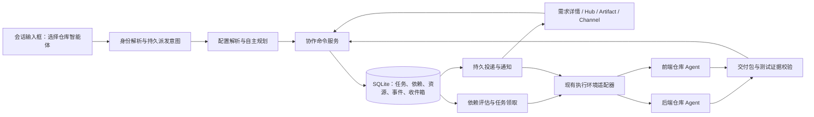

# 多仓库协作：技术设计与实施计划

本文件的首期（M0～M3）已落地，实现位置与验收证据见 [§11](#11-首期实现与验收记录)。产品目标、MR 编号与 AC-01～AC-32 见 [需求方案](./README.md)；具体交互、决策与 AC-33～AC-40 见 [运行规则](./OPERATING-SPEC.md)。

## 1. 架构决策

将协作状态、任务领取、交付校验结果和消息放在 Rust + SQLite 的持久协调层。React 负责展示和执行适配；即使首期仍依赖现有前端会话能力，也必须先领取持久租约再启动，不能通过多个 Hook 各自扫描并直接派发同一任务。



LLM 可规划任务、提出问题分类与修正建议；数据库中的依赖条件和校验器决定是否启动/完成。自然语言“已完成”和会话 idle 仅用于提示收集产物，不作为依赖通过条件。

前端 UI 退出时本机执行桥可能不可用：任务保留为待领取或失联待核对，进程重启后恢复。真正无 UI 常驻执行是后续运行环境能力，不在首期作虚假承诺。

### 1.1 持久智能体与执行身份

扩展现有 Assistant 身份和 Hub，新增“仓库智能体”配置档案；不另建一套重复的助手目录。区分 assistant/template（可复用定义）、agent profile（独立实例）、requirement owner（主责身份）、task executor（执行身份）与 session/attempt（一次运行）。从同一助手模板创建两个 profile 时，配置和记忆必须独立。

主责智能体可同时绑定前后端仓库；每个执行尝试仍固定一个仓库/worktree。它通过分仓库任务连续或并行工作，满足“一位智能体负责多个仓库”，不要求不同仓库拥有不同智能体。委派给专业智能体时，执行者使用自己的配置，仅接收明确授权的需求资料、交付包和任务说明，不复制主责者的私有记忆或 MCP 凭据。

保存 ownerAgentId、executorAgentId、delegatedByTaskId、delegationDepth；首期 depth ≤ 1。主责协调采用串行决策租约和 revision CAS，防止两个规划会话同时修改同一需求。收到事件后更新必要任务，不无限自我唤醒。

### 1.2 配置解析与实际隔离

新增 `resolveRepositoryAgentRuntime(agentId, profileRevision, projectId, repositoryId, taskId)`，复用现有助手解析逻辑并返回结构化生效清单。每个 agent profile 的基础配置独立，仓库覆盖仅按 `(agentId, projectId, repositoryId)` 匹配；协调规划阶段只读取职责摘要，不把各仓库完整规则混成一个全局提示。

配置解析规则：

1. 平台执行边界与权限始终生效；当前用户任务约束执行范围。
2. 模板在创建 profile 时形成固定基线；允许的项目默认项需显式选择继承，默认不引入其他助手或全局用户目录中的私有配置。
3. SOUL 和智能体 AGENTS.md 来自锁定 profile；应用该智能体对当前仓库的专用覆盖。标量按显式覆盖处理，Skill/MCP 按稳定 ID 增减，禁用项不能被浅合并重新启用。
4. 目标仓库及目录的原生规则保持其适用范围，记录路径与 hash；智能体工作规则补充通用要求，不能覆盖仓库强制工程约束。用户明确指定的本次例外单独记录；无法同时满足时形成决策项。
5. 知识和记忆是带来源的数据，不提升为系统规则。Skill 内容按适用任务加载；MCP 清单经过任务、智能体、项目及运行环境授权的共同约束。

SOUL.md / AGENTS.md 存于 Wise 管理的智能体配置目录，通过引擎支持的指令通道或独立运行配置挂载，不写入共享仓库根文件。引擎若自动读取用户级技能、记忆或 MCP，适配器必须关闭隐式继承或使用独立运行配置；仅在提示词中写“请不要使用”不算隔离。不能修改共享 HOME 或全局 MCP 配置来切换智能体。

执行前校验实际可用 Skill、MCP 服务和工具白名单；返回 `effectiveConfigManifest`，含来源层、配置版本/hash、规则路径、知识/记忆引用、技能版本、MCP 连接及工具 ID、凭据引用、引擎能力。每项能力标记 required/optional：缺失必需能力或无法落实隔离时阻塞相应尝试；可选能力缺失则从生效清单移除并记录降级原因。现有非仓库智能体执行入口保持兼容，不通过静默省略配置伪装成功。

需求启动时锁定主责配置和已选执行者配置；中途新增专业执行者时以显式计划版本固定其配置。恢复使用相同快照，权限收回优先于快照。仓库规则与代码版本一同追踪，新 commit 引入规则变更时记录 manifest 差异并重新校验。

### 1.3 独立知识与记忆生命周期

知识复用现有方案的资源与版本模型，增加 agent-private 的拥有者及授权。检索同时满足执行智能体、任务项目和资源授权；跨智能体共享需显式发布或给出限定接收者的交接授权，项目成员资格不自动开放 agent-private 内容。

记忆至少记录 agentId、scope（agent/repository/requirement）、projectId/repositoryId、正文、来源 attempt/证据、可信状态、版本、有效期及删除时间。任务临时状态保留在检查点；稳定经验才进入长期记忆。可默认自动保存有成功验证证据的经验，未经验证的候选记忆不能以确定事实注入。

同一智能体的通用记忆仅用于真正通用内容；来源带项目/仓库限制的记忆不能因智能体横跨多个仓库而扩大可见范围。执行 manifest 固定本次读到的 memory ID/revision，后续新增记忆只影响新的检索快照；删除后立即排除新检索，并使受影响上下文缓存失效。历史审计若保留旧快照，界面需明确显示，不能声称抹除了已发送内容。

记忆更改使用 CAS 和来源去重，避免并发仓库任务相互覆盖。“清空记忆”不删除 SOUL、AGENTS.md、知识或执行记录；从模板创建/复制智能体默认不复制历史记忆与凭据。删除或停用 profile 保留历史身份与交付链。

### 1.4 会话派发与自主规划

输入框发送结构化意图：`requestId, originSessionId, originMessageId, targetKind=agent, agentId, mode, requirementId?, projectContext?, body, attachments`。选择器稳定 ID 优先于纯文本解析；agent、repository、role 使用独立命名空间。显式目标 > 会话绑定 > 当前项目/仓库默认，歧义返回候选而非广播。

mode 固定为 discuss / plan / execute。执行模式在事务内按 requestId 创建需求及规划意图，保存消息→需求→主责智能体关联，并写 outbox；发送重试返回原需求。先规划模式只创建待启动需求及只读规划尝试；讨论模式不进入执行命令。继续需求必须携带 requirementId 和 expectedRevision；无法明确关联时仅请求澄清。原会话关闭后需求仍可从列表访问，重开会话可重新绑定。

规划尝试先在绑定仓库的读取范围内检查代码、接口和共享资料，提交带证据的结构化计划：涉及仓库、责任项目、必要改动、Agent、依赖、交付、验收及判断依据。验证器检查绑定范围、权限、DAG、执行能力后，在执行模式自动发布启动；只有先规划模式或实际决策阻塞才等待用户。

自主判断由智能体完成，校验器约束可执行范围和完成条件。已有接口可复用时不创建多余后端任务；需要变更时生成后端→前端依赖。修正责任由证据及契约生产者确定，沿用修正单和 outbox。原会话仅展示持久状态投影，消息可重放，不因消息推送失败丢失执行。

## 2. 数据模型

以下为逻辑表及关键字段，具体 migration 编号实施时根据仓库最新状态确定。时间使用 UTC 时间戳，资源/消息/任务使用稳定 ID；仓库沿用数字 ID，不用绝对路径当跨环境身份。

| 逻辑表 | 关键字段和约束 |
| --- | --- |
| `collaboration_spaces` / `collaboration_members` | 空间与成员项目；成员关系不隐含资源读写授权 |
| `repository_agent_profiles` | id、assistant_id、name、default_owner_project_id、status、active_revision；一个助手模板可实例化多个独立 profile |
| `repository_agent_revisions` | agent_id、revision、SOUL/AGENTS 内容引用/hash、knowledge_refs、memory_policy、skill_bindings、mcp_bindings、engine/model、delegation_policy；不可变快照 |
| `repository_agent_bindings` | agent_id、project_id、repository_id、职责、授权范围、覆盖配置、is_default；每项目/仓库至多一个默认负责者 |
| `repository_agent_memories` / `repository_agent_memory_revisions` | agent_id、scope、项目/仓库范围、内容版本、来源与可信状态、有效期、删除标记 |
| `agent_dispatch_intents` | request_id 唯一、origin_session/message、agent_id、mode、requirement_id、state；保留会话派发与恢复关联 |
| `collab_requirements` | id、owner_project_id、owner_agent_id、profile_revision、body、business_status、control_status、revision、active_plan_revision、acceptance_policy、legacy_id |
| `collab_requirement_projects` | requirement_id、project_id、参与职责；需求与项目多对多 |
| `collab_plan_revisions` | requirement_id、revision、任务/依赖快照、activation_time；发布后不可改写 |
| `collab_tasks` | id、requirement_id、project_id、repository_id、role、kind、state、revision、spec_revision、executor_agent_id、profile_revision、delegated_by_task_id、delegation_depth、runtime_target、workspace_binding、checkpoint_id |
| `collab_dependencies` | task_id、producer_task_id、gate_kind、artifact_selector、required_version、validation_policy、plan_revision |
| `collab_attempts` | id、task_id、generation、session_id、dispatch_key、input_manifest、effective_config_manifest、lease_owner、lease_expiry、fencing_token、result；每任务至多一个活动尝试 |
| `collab_checkpoints` | task_id、attempt_id、代码位置与工作树摘要、已完成项、待办、失败用例、锁定版本、恢复说明 |
| `collab_artifacts` / `collab_artifact_versions` | 逻辑资源与不可变版本；producer_task、commit、内容 hash、契约、环境指纹、校验状态、失效原因 |
| `collab_artifact_consumers` | task_id、artifact_version_id、所用接口/字段、验证结果、影响状态；唯一约束保护重复登记 |
| `collab_change_requests` | id、requirement_id、producer_task_id、dedupe_key、round、revision、state、问题结构、当前修正任务与版本 |
| `collab_change_consumers` | change_request_id、consumer_task_id、round、expected_version、retest_attempt_id、ack_status；一轮一个消费者回执 |
| `collab_resources` / `collab_resource_versions` | 业务/技术知识、能力/环境引用；owner_agent_id（私有时）、来源、维护者、版本、内容位置、hash、发布范围 |
| `collab_resource_grants` / `collab_resource_subscriptions` | 资源→项目/智能体的显式读取授权及订阅，支持限定交接任务；区分空间默认授权、单项授权及 agent-private，带授权版本 |
| `collab_messages` / `collab_deliveries` | 稳定消息、接收任务、类型、correlation/causation、轮次、版本；每接收方独立投递/处理状态 |
| `collab_events` / `collab_outbox` | 同事务追加领域事件与待投递记录；事件有聚合序号，outbox 有重试次数与 next_retry_at |
| `collab_decisions` | requirement_id、受影响 task_ids、阻塞操作、类型、证据、可选动作、state、revision；局部决策不直接切换需求总控制状态 |
| `collab_revision_impacts` | 需求/计划新旧版本、task_id、沿用/重做/新增/取消、理由、可沿用证据及输入 hash |
| `collab_acceptance_manifests` | requirement_id、revision、代码/契约/环境/测试清单、内容 hash、state、验收策略和结论 |
| `collab_runtime_resources` / `collab_runtime_consumers` | 环境/服务/端口/夹具、owner、启动执行、停止方式、状态及消费者引用；不管理用户自有进程 |
| `collab_usage_ledger` | requirement_id、attempt_id、幂等计量事件、执行时长、用量来源及可信度；重试和换会话不重置预算 |

约束补充：

- 任务绑定 `project_id + repository_id`，派发前校验仍属于获准参与集合；同仓库多项目归属不能导致重复实现任务。
- `workspace_binding` 至少包含 runtimeTargetId、仓库标识、baseCommit、branch、worktreePath；不同主机的路径独立解析。
- 一个 Agent 尝试只写绑定的工作区。默认每个需求/仓库隔离 worktree，同仓库任务共享 worktree 时串行领取写租约；允许独立 worktree 并行，但合并前须解决冲突。
- 大文件存于受控内容存储，SQLite 保存索引、hash 和引用。远端不能只接收本地绝对路径，必须通过资源传输适配器验证可用内容。
- 引用删除采用归档/失效，保留已执行版本与验收链。索引不能越过授权过滤，日志和响应样例应脱敏。

## 3. 状态机与依赖

### 3.1 任务状态

```text
waiting_dependencies → ready → running → checking → succeeded
running/checking → waiting_change → ready（带复验动作）
running/checking → failed → ready（新尝试）
任何未终结任务 → cancelled（活动尝试已确认停止）
```

`waiting_change` 表示暂停业务实现、等待修正版本；当全部阻塞单都提供有效候选修正、其他依赖也满足后，恢复到 ready，下一次尝试先复验。不能要求修正单已经 closed 才恢复，否则“关闭需要前端复验、前端又等待关闭”会死锁。

`succeeded` 对应某个任务规格和输入版本；后续破坏性变更应显式生成重新验证/修正任务，不能静默改写此前成功记录。需求 control_status 为 active / pausing / paused / cancelling / cancelled，与业务状态独立；需要决策由 `collab_decisions` 投影，按任务/操作范围阻塞。暂停检查点落盘且执行停止后，任务回到可重新评估的非运行状态，但 paused 需求不能 claim；取消期间保留活动 attempt 与写锁，不能只改 UI 状态便释放资源。

### 3.2 修正单状态

```text
open → triaged → fixing → ready_for_retest → verified → closed
ready_for_retest → fixing（复验失败，round + 1）
open/triaged/fixing/ready_for_retest → needs_decision
open/triaged → rejected（记录证据与理由）
```

只有明确的范围外请求、误报或重复单可 rejected；需附责任决策或可验证证据，被阻塞消费者收到原因。被指派后端只能提交拒绝建议，主责通过受控复验或明确人工决策决定是否拒绝；后端建议本身不解除阻塞。重复单的消费者转移到主单。待决策解决后按结果进入 fixing、rejected 或重新规划；不能直接关闭未验证缺陷。

每轮修正生成独立 repair task，历史后端实现任务保持成功。问题往返属于事件驱动的修正轮次，不能向原任务 DAG 插入“前端依赖后端、后端又依赖前端”的反向边。

### 3.3 任务放行条件

任务领取前在事务中核对：

1. 需求 control_status=active，运行策略允许启动，任务规格仍被当前计划采用且无覆盖此操作的未解决决策。
2. 所有必需依赖满足；交付版本未失效、环境指纹和测试证据符合验证策略。
3. 消费者相关阻塞单全部具备有效复验版本，或不存在阻塞。
4. 资源授权及运行能力仍有效；仓库与目标环境匹配。
   智能体仍启用、仓库绑定有效，锁定配置可解析且所需 Skill/MCP 实际可用；撤销覆盖旧快照权限。
5. 全局/环境并发额度允许，工作区写租约可领取，任务没有其他活动尝试。

依赖计划发布时拒绝循环、自依赖、不存在的生产者及无法访问的输入。多上游依赖默认 AND；首期不开放含糊的任一完成语义。无就绪任务时汇总根因链，区分正常等待与需决策的死锁/不可满足条件。

## 4. 接口交付与问题载荷

交付版本至少包含：

```text
artifactId, version, producerTaskId, requirementId, planRevision
repositoryId, commitSha, branch, contractRef, contractHash
runtimeTargetId, environmentId, endpoint, deployedCommit, healthCheckAt
credentialRef, setupGuideRef, fixtureRefs
testEvidenceRefs, compatibility, supersedesVersion, affectedOperations
```

字段列表完整性由交付类型定义，校验结果作为独立记录保存；HTTP 契约检查、接口用例、部署指纹校验三者都需可追溯至交付版本。环境变化或超过策略规定的健康检查有效期时，消费前重新检查。契约不是完整业务验收，仍需跨仓库用例。

修正单载荷至少包含：需求/任务 ID、生产者、消费版本、接口、字段或断言、期望/实际、请求与响应引用、可复现步骤、环境版本、影响范围、验收条件、检查点、轮次。

Agent 提供结构化载荷，由命令层校验；字段不全则返回具体错误，并显示“待补充反馈”，不触发无上下文派单。兼容性判定至少覆盖删除字段、字段类型/必填性变化；无法自动判断时标为 unknown，由明确决策处理。

## 5. 消息与可靠恢复

### 5.1 消息信封

```json
{
  "schemaVersion": 1,
  "id": "msg-fix-17-round-1",
  "type": "change.ready_for_retest",
  "requirementId": "REQ-42",
  "planRevision": 1,
  "sourceTaskId": "REPAIR-17-1",
  "targetTaskId": "FE-1",
  "correlationId": "FIX-17",
  "causationId": "event-publish-orders-api-2",
  "aggregateSequence": 8,
  "changeRevision": 3,
  "round": 1,
  "artifactRefs": [{ "id": "orders-api", "version": 2 }],
  "checkpointId": "cp-fe-1",
  "action": "retest_then_continue"
}
```

消息类型至少包括 `task.assigned`、`artifact.ready`、`change.requested`、`change.ready_for_retest`、`change.retest_failed`、`change.verified`、`resource.version_published` 和 `decision.required`。

同一事务完成：修正/交付状态更新、领域事件、逻辑消息与 outbox 插入。投递器使用至少一次投递，接收方以 `(messageId, targetTaskId)` 去重。UI 通知、任务执行和外部 Channel 投递分别有回执；外部通知成功不代表 Agent 已处理。

消息只唤醒调度器重新评估最新状态，不能直接把任意会话改为可运行。旧轮次、失效版本、已取消需求的事件留作历史，不改变当前执行状态。聚合序号不连续时读取数据库当前状态后补齐，不依靠网络到达顺序推导状态。

### 5.2 执行领取和崩溃窗口

建议 dispatchKey = taskId + generation；数据库对 dispatchKey 唯一，并通过事务 CAS 校验 task.revision。先持久创建 attempt 和执行意图，再调用执行桥，执行桥必须以同一 dispatchKey 幂等建会话并登记映射。

若“会话已创建、回执未保存”时崩溃，恢复时先按 dispatchKey 查询现有会话/运行记录；不能立即启动第二次。原执行状态无法确定时进入失联待核对，保护工作区不被两个 Agent 同时修改。

领取产生租约与递增 fencing token。租约到期只代表需要核对，不证明原进程已经结束；新执行必须确认旧进程停止或已隔离，并取得新的工作区写租约。旧 token 的迟到交付不能更新新尝试状态。

原会话可恢复时复用，但仍创建新的 attempt 并记录新的输入版本；原会话失效时从检查点重建。等待依赖时停止占用执行槽位，不保持模型空转。

### 5.3 消费者竞争与轮次

- 创建修正单按规范化问题指纹去重；只有同一需求、生产接口、消费版本和问题断言一致才合并。
- 每轮修正按 `(changeRequestId, round)` 幂等创建一个 repair task。后端多个修正写入同一工作区时排队，可组合提交，但必须逐单提供证据。
- 对同一消费者的多个就绪消息合并为一次新 attempt，记录涵盖的所有修正单/轮次/版本。
- 某消费者使修正单进入下一轮后，上一轮其他消费者的迟到确认不关闭新轮次；新轮次重新确定受影响消费者及复验要求。
- 默认自动修正预算为 3 轮。预算耗尽仍保留原 issue、检查点与消息，收到决策后按显式增加的预算继续。

## 6. 命令与执行适配接口（拟新增）

| 命令/能力 | 输入与结果 |
| --- | --- |
| `create/update_repository_agent` | 助手来源、名称、六类配置、expectedRevision → 独立 profile 及配置版本 |
| `bind_repository_agent` | agentId、项目/仓库、职责、默认标记、专用配置 → 已校验绑定 |
| `resolve_repository_agent_runtime` | agentId、profileRevision、项目/仓库、taskId → 生效 manifest 与能力诊断 |
| `dispatch_requirement_to_agent` | 结构化派发意图 → 幂等需求 ID、主责智能体、规划状态；讨论模式不接受执行 |
| `list/update/delete_agent_memory` | agentId、作用域、memoryId、expectedRevision → 授权后的记忆及审计结果 |
| `create_collaborative_requirement` | 主责项目、参与项目、正文与验收 → 需求 ID 与 revision |
| `publish_collaboration_plan` | 任务、依赖、expectedRevision → 校验后计划版本 |
| `start/pause/resume/cancel_collaboration` | 需求 ID、expectedRevision、requestId → 控制状态 |
| `claim_collaboration_task` | runtimeTarget、能力、并发信息 → attempt、租约、上下文包 |
| `record_collaboration_checkpoint` | attempt、token、检查点 → checkpoint ID |
| `publish_collaboration_artifact` | attempt、token、交付描述 → 候选版本与待校验状态 |
| `validate_collaboration_artifact` | 交付版本与验证策略 → 证据、有效性；仅校验器可写权威结果 |
| `submit_integration_change` | 问题载荷、requestId → 新建/合并修正单 |
| `acknowledge_integration_retest` | consumer attempt、round、version、证据 → 消费者回执与聚合状态 |
| `publish/subscribe/search/read_shared_resource` | 资源版本、授权项目/任务、查询 → 经过授权的资源及来源 |
| `list_collaboration_messages` | 需求/任务、cursor → 消息与处理状态 |
| `get_collaboration_snapshot` | requirementId → 当前计划、任务、依赖、修正、产物和事件游标 |
| `revise_collaborative_requirement` | requirementId、expectedRevision、追加输入 → 影响清单、修订或待决策提案 |
| `resolve_collaboration_decision` | decisionId、expectedRevision、选择/证据 → 新状态与受影响任务重新评估 |
| `transfer_requirement_owner` | requirementId、expectedRevision、targetAgentId → 停稳旧协调执行后的主责/计划新版本 |
| `accept_collaboration_manifest` | requirementId、manifestRevision、manifestHash、expectedRevision → 当前清单的幂等验收结果 |

变更命令携带 requestId 实现请求幂等，并携带 expectedRevision 或 attempt token 防并发覆盖。命令层从绑定会话/执行身份解析权限，不信任 Agent 自填 projectId。对外提供现有引擎可调用的工具/命令适配，避免靠解析聊天文案推进状态。

执行适配器必须支持 start、resume、queryByDispatchKey、cancel、capabilities；不支持 resume 的引擎可使用上下文包 start，仍保持同一任务历史。远程不具备资源读取或环境连接能力时，claim 返回明确阻塞原因。

capabilities 还须说明独立指令、原生仓库规则加载、Skill 挂载、MCP 工具限制和记忆隔离能力。新配置不兼容原会话时，保留任务身份与检查点，以兼容的新会话执行，不把不同智能体配置混入原会话。

## 7. 共享资源实现

发布步骤为：校验来源与授权 → 生成内容快照/hash → 写版本与共享范围 → 发布资源事件。已发布版本不可原地修改；订阅记录保留所跟踪的逻辑资源，任务输入保留精确版本。

每次构建上下文：按任务身份过滤授权资源 → 合并显式依赖与关键词命中 → 按用途排序与预算裁剪 → 保存 input_manifest → 分发摘要和可读取引用。input_manifest 记录资源版本/hash/授权版本，便于事后解释 Agent 当时看到什么。

跨项目共享的规范冲突不能由检索排序隐式裁决。明确指定的需求契约约束接口消费；项目规范若与契约冲突，建立待决策项，由维护者发布新版本。

凭据引用交给运行环境解析；共享知识不得把凭据解析结果再次写入资源。授权撤销使后续读取失效，通知正在运行的受影响任务在检查点停止或等待决策，并保留已分发快照的审计说明。

## 8. 迁移与现有文件衔接

| 当前文件 | 拟议改动 |
| --- | --- |
| `src/types/assistant.ts`；`src/services/assistants.ts` | 保留助手模板与原入口，增加独立仓库智能体档案和绑定引用 |
| `src-tauri/src/assistants/runtime_resolver.rs`；`src/services/assistantPromptLayers.ts` | 复用覆盖解析，扩展 profile/revision、SOUL/AGENTS、资源记忆及实际能力 manifest；保留旧解析入口 |
| `src/services/atMentionDispatch.ts` | 分类解析智能体/仓库/角色，智能体走持久意图及自主规划，保留已有仓库路由 |
| `src/services/assistantTemplateActivation.ts` | 仓库智能体接入协调服务，保留脚本、链接和原工作流入口 |
| `src/components/AssistantsPanel/index.tsx` | 在现有助手 Hub 提供仓库绑定和六类独立配置，不新增重复市场/配置中心 |
| `src/types/workspaceRequirements.ts` | 保留 V1 读取；添加协作摘要/关联类型，避免向 V1 塞入另一套可写状态机 |
| `src/services/workspaceRequirementsStore.ts` | 保留公共调用入口；迁移后通过后端命令访问权威数据，去掉协作项的整表覆盖写入 |
| `src/hooks/useWorkspaceRequirementAutoDispatch.ts` | 协作项转为唤醒持久调度；禁止旧扫描器重复派发已迁移项 |
| `src/services/workspaceRequirementDispatch.ts` | 保留图片处理，协作派发追加结构化任务上下文与明确仓库目标 |
| `src/services/executionEnvironmentDispatch.ts` | 新增按任务目标派发入口、dispatchKey、attempt/session 绑定；保留原会话派发能力 |
| `src/services/executionEnvironmentDispatchPersistence.ts` | 关联任务/尝试、幂等键；支持重启核对会话与派发结果 |
| `src/services/sessionFeedbackLoopDispatch.ts` | 保留现有分析功能；跨仓库修正通过新协调服务执行，避免以原仓库路径错误派发 |
| `src/hooks/useSessionFeedbackLoopDispatchCompletion.ts` | 保留原分析回调；协作任务 idle 只触发产物收集，不直接认定成功 |
| `src-tauri/src/requirement_execution_records.rs` | 保留旧日志读取；追加可选 task/attempt/round 关联，或提供联合查询适配 |
| `src/services/workflowKnowledgeRetrieval.ts` | 增加显式授权资源和来源上下文；继续兼容当前仓库检索提示 |
| `src/components/WorkspaceMemoPanel/WorkspaceRequirementModal.tsx` | 多项目/多仓库选择、主责项目、协作方式与计划入口 |
| `src/components/ArtifactsPanel/index.tsx` | 增加需求视角、版本对照、交付校验与验收关联 |
| `src/notifications/hub.ts` | 作为协作消息的 UI 投影，不承担持久消息队列职责 |

建议新建 `src-tauri/src/collaboration/`（命令、仓储、调度、校验、消息、共享资源）及 `src/services/collaboration/`、`src/types/collaboration.ts`、`src/components/RequirementCollaboration/`；实施时遵循最新模块组织方式。

迁移流程：

1. 备份原 app_settings 需求 JSON 与执行记录；新增表与迁移标志，不删除旧数据。
2. 事务导入每条需求，保留原 ID、正文、图片、排序、时间、状态与会话；单仓库需求默认生成一项任务。`repositoryId` 为空或归属不明确时标记待补齐，不擅自选仓库。
3. 旧 done 映射为“历史验收完成”，verifying 映射为待验收，open 保持待办；旧成功不能伪造新的契约测试证据。
4. 已有运行会话先绑定历史 attempt，保持执行，不能迁移后重复派发。迁移前后的旧扫描器通过迁移标识与后端唯一约束隔离。
5. 后端事务保证所有已迁移需求只走一条权威写路径；V1 接口保留为兼容适配，不能让旧整表保存覆盖新协作状态。
6. 数量、ID、历史关联校验通过后切换读取。迁移可重复运行；失败整体回滚并继续旧路径。
7. 版本回退前需暂停协作并导出快照；旧程序不理解多仓库任务，不能以旧程序直接写新数据作为无损回滚。原 V1 备份仅用于恢复迁移前状态。
8. 已有助手和仓库 Owner 名称保持可用；通过稳定 ID 显式转换或绑定 profile，名称不能作为唯一身份。首次生成 profile 可导入已选择的有效提示词/Skill/MCP 配置，但不自动复制历史会话为长期记忆，也不把原始凭据写进配置快照。

## 9. 开发工作包与测试

| 工作包 | 依赖 | 交付与必测项 |
| --- | --- | --- |
| W0 执行能力验证 | 无 | 针对候选本地引擎验证配置隔离、工具暴露、稳定派发 ID 核对、恢复/取消；输出实测能力矩阵，确定首期适配器 |
| W1 持久模型与迁移 | 无 | schema、版本/CAS、旧需求幂等迁移、历史日志联合读取；AC-16 |
| W9 仓库智能体与配置 | W1 | 身份、绑定、六项配置、版本、规则/Skill/MCP 生效与隔离、Hub 编辑、配置生命周期；AC-21/22/26/31/32/33；基础随 M1、完整能力随 M3 |
| W2 按仓库执行适配 | W0/W1/W9 基础 | 目标绑定、配置 manifest、worktree/写锁、dispatchKey、会话查询与恢复；AC-01/02/13 |
| W3 依赖与可靠调度 | W1/W2 | DAG 校验、租约、并发预算、暂停/取消、局部决策、失联核对；AC-03/04/10/14/36/38 |
| W4 接口包与验证 | W1/W2 | 契约、commit/环境绑定、接口用例、版本失效与验收清单；最小验证随 M1；AC-03/04/19/20/40 |
| W5 修正与消息闭环 | W3/W4 | outbox、收件箱、去重、轮次、多消费者、争议复核和自动恢复；AC-05～09/17/18/37 |
| W6 共享资源服务 | W1 | 发布/订阅、版本锁定、授权搜索、上下文 manifest；AC-11/12 |
| W10 会话派发与自主规划 | W2/W3/W9 基础 | 三模式、幂等意图、主责协调/移交、范围判断、自动计划、运行中修订与单层委派；AC-23/24/25/28/29/34/35/39；派发随 M1、委派随 M2 |
| W11 独立知识与记忆 | W6/W9 | 私有作用域、记忆读写、来源、版本及删除失效；AC-22/27/30；随 M3 |
| W7 需求界面与产品集成 | 各服务接口稳定后分步接入 | 最小任务详情随 M1 交付，完整六页签及 Hub/Channel/Artifact/Automation 随 M3 交付 |
| W8 整体验收 | W3～W7/W9～W11 | 输入框到自主跨仓库闭环、配置隔离、异常注入及历史兼容；全部 40 项 AC |

单元测试集中在状态转换、DAG 校验、门槛评估、版本影响、去重和聚合验收。SQLite 集成测试覆盖并发 claim、事务回滚、outbox 重放、迁移重入；执行桥测试覆盖崩溃前后相同 dispatchKey 的查询与去重。

端到端测试使用可控的后端/前端示例仓库：后端 V1 故意缺字段 → 前端用例失败 → 后端 V2 修正 → 前端自动复验通过。额外注入旧消息晚到、两个前端同时反馈、暂停后修正到达、会话丢失、环境版本不匹配与授权撤销。

仓库智能体端到端从输入框一句需求开始，不预填人工拆分计划。分别验证一个智能体负责前后端、主责委派专业智能体、仅前端需要改动三种情况。隔离测试使用同引擎同仓库的两个智能体，分别设置不同 SOUL、规则、私有知识/记忆及互斥 Skill/MCP；检查实际进程/工具暴露和上下文，不只断言 UI 配置不同。验证既有仓库 AGENTS.md 未被覆盖、全局 MCP 未被改写、禁用工具不会被隐式继承。

具体故障窗口至少测试“事务已提交但未投递”“投递已到达但未回执”“会话已启动但映射未回报”“租约过期但旧进程仍活着”“前端已复验但确认消息重复”。这些路径必须保持无重复业务派发和无并行误写。

可观测记录使用 requirementId / taskId / attemptId / changeRequestId / messageId 串联；界面能回答“为什么还没启动”“谁在等谁”“这次恢复用了哪个接口版本”。性能目标在实现基线测试后确定，不以未经测量的吞吐量作为已具备能力。

## 10. 修订、控制与验收的一致性

### 10.1 按影响修订，不重跑所有任务

区分 requirementRevision（需求正文与验收）、planRevision（任务编排）、taskSpecRevision（该任务的职责/输入/输出）、profileRevision（智能体配置）和 artifactVersion（交付内容）。新 planRevision 不等于所有旧 attempt 自动过期。

追加输入先生成影响清单，在事务中保存修订及每个任务的沿用/重做/新增/取消决定。未改变 taskSpecRevision、输入 hash 且证据有效的任务可被新计划显式沿用；受影响任务进入检查点停止，旧结果仅保留历史。不能在还运行的同一 attempt 上热替换 prompt 或契约后继续使用原输入快照。

结果提交时重新核对 taskSpecRevision、当前计划的采用关系、fencing token、输入/交付有效性和需求控制状态。新旧计划竞争通过 expectedRevision 返回冲突，不靠“最后写入者覆盖”。用户范围变更提案尚未确认时，不改动已授权计划的业务范围。

### 10.2 暂停、取消与停用

控制变更与停止意图、事件、outbox 同事务写入。claim 同时读取控制状态；已经领到但尚未启动的 attempt 在执行桥启动前再校验。若取消发生在检查与 spawn 之间，桥必须按已持久化 dispatchKey 发现并终止该执行，保持工作区锁直到退出确认；不能把启动前检查描述成跨进程原子操作。

执行桥停止超时写入可观察的 stop_pending，并持续核对真实进程；租约到期不自动回收仍有活动写入的工作区。只有进程退出或环境已可靠隔离后才能结束 attempt。退出前收到产物仍可保存，但不得因完成回调将 cancelled/paused 需求改回 active。

界面聚合优先呈现 cancelling/cancelled、pausing/paused，再展示局部决策、阻塞与执行进度。旧 open/verifying/done 字段只作业务投影；已迁移或已取消项一律不交给旧自动扫描器派发。

### 10.3 验收清单与争议复核

验收清单冻结需求/计划版本、所有必需 taskSpecRevision、仓库 commit、契约版本、环境指纹、测试/回归证据、消费者回执和修正单 revision。新提交、契约升级或验收口径变化使受影响清单失效；重新生成清单后才可接受。

验收事务校验当前清单 hash/revision、需求运行状态、所有必需任务与消费者完成情况及无未解决阻塞/决策，再记录 accepted 和业务 done。重复 requestId 返回原结果。过期页面返回 `STALE_ACCEPTANCE` 并刷新差异；不能用前端曾显示“通过”代替提交时检查。

被指派方提交 rejected 建议只创建争议决策，复核记录独立保存提出方、验证执行、证据和处理者。所有解决路径都触发消费者重新评估：确认误报可继续原版本；真实修正必须复验新版本；合并重复问题迁移等待关系。避免将 rejected 单永远保留为阻塞，或把拒绝等同复验通过。

### 10.4 预算、环境与命令错误

预算在 requirementId 上累计，以 attempt/用量事件 ID 幂等记账；claim 前为并发任务预留可用额度，执行桥按可用计量信号检查。仅有结束后计量的引擎不能承诺精确用量硬上限，须显示估算/可能超出，并以时间/轮数限制提供可执行边界。主责协调等待也要结束当前模型调用并释放槽位。

环境准备/清理作为显式任务接入 W2/W3/W4；共享环境清理需事务确认无有效消费者，且只控制 Wise 登记的服务。先停止服务确认退出，再回收端口/夹具；未合并 worktree 由用户审阅后清理，不跟随消息 TTL 删除。

命令失败统一返回 `code, message, retryable, currentRevision?, affectedTaskIds, suggestedAction`。至少区分 `AMBIGUOUS_TARGET`、`REVISION_CONFLICT`、`AGENT_DISABLED`、`REQUIRED_CAPABILITY_MISSING`、`DEPENDENCY_NOT_READY`、`STOP_PENDING`、`BUDGET_EXHAUSTED` 和 `STALE_ACCEPTANCE`。可重试传输错误复用原 requestId；修正载荷或用户意图后使用新 requestId，避免幂等键对应不同内容。

配置草稿、发布、回退使用同一版本写入服务；普通配置升级仅影响新需求。权限撤销单独更新授权版本并使缓存失效，不能等待下次配置发布。M0 能力矩阵必须记录这些运行边界，未验证的引擎标为未验证，而不是推测全部支持。

## 11. 首期实现与验收记录

### 11.1 实现位置

| 工作包 | 实现 |
| --- | --- |
| W1 持久模型与迁移 | `src-tauri/migrations/054_collaboration.sql`；`collaboration/model.rs`、`legacy.rs`（V1 备份、幂等导入、旧项标记） |
| W0 / W9 智能体、配置与能力矩阵 | `collaboration/agents.rs`（身份、绑定、草稿/发布/回退/检查/停用）、`runtime.rs`（生效配置 manifest、引擎能力矩阵、spawn 配置） |
| W2 / W3 执行适配与调度 | `scheduler.rs`（claim、租约、fencing、工作区锁、预算、暂停/取消、失联核对、检查点）；前端 `useCollaborationExecutionBridge` |
| W4 接口包与验证 | `artifacts.rs`（契约差异、commit/环境/健康校验、破坏性变更复验）、`verification.rs`、`acceptance.rs`（验收清单、证据门槛） |
| W5 修正与消息 | `changes.rs`（修正单、合并、轮次、争议、环境类）、`decisions.rs`、`events.rs`（事件、消息、投递状态、outbox、收件箱） |
| W6 / W11 资源与记忆 | `resources.rs`（发布/授权/订阅/空间/检索）、`context.rs`（上下文包与输入 manifest）、`memory.rs` |
| W10 派发与规划 | `requirements.rs`（三模式派发、修订、控制、主责移交）、`plans.rs`（计划校验、影响清单、激活）、`bridge.rs` + `wise-collab` CLI |
| W7 界面与产品集成 | 输入框接收者与需求卡片；需求详情六页签；Hub「仓库智能体 / 共享资源」；仓库「负责智能体」与「项目协作与共享」；Automation「多仓库协作调度」；Artifact「跨仓库交付」；Channel「协作收件箱」 |

### 11.2 验证命令

`cargo test --lib`（718 项通过，其中协作层 46 项集成/单元测试）；`bun test`（协作相关用例全部通过，其余失败项与未改动的 `HEAD` 完全一致，属既有 mock 污染）；`bunx tsc --noEmit` 无错误。

### 11.3 AC 证据

以下测试均位于 `src-tauri/src/collaboration/tests.rs`，前端纯逻辑见 `src/services/collaboration/*.test.ts`。

| AC | 证据测试 |
| --- | --- |
| 01 / 02 | `multi_repository_tasks_use_their_own_directories` |
| 03 | `producer_without_delivery_keeps_consumer_blocked` |
| 04 / 05 / 06 | `cross_repository_delivery_change_and_retest`、`new_session_resumes_from_checkpoint_with_versions` |
| 07 / 08 | `merged_consumers_rounds_and_repair_budget` |
| 09 | `consumer_blocked_by_two_changes_waits_for_both` |
| 10 | `dispatch_is_idempotent_by_request_id`、`stale_fencing_and_lease_expiry`、`merged_consumers_rounds_and_repair_budget`（旧轮次回执被拒） |
| 11 / 12 | `authorized_knowledge_is_pinned_for_running_tasks`、`resource_authorization_and_revocation` |
| 13 | `new_session_resumes_from_checkpoint_with_versions` |
| 14 | `repair_result_during_pause_is_recorded_and_waits`、`cancel_races_with_completion_and_never_revives`、`pause_resume_cancel` |
| 15 / 40 | `acceptance_requires_current_manifest_and_passing_evidence` |
| 16 | `legacy_v1_import_is_transactional_and_idempotent` |
| 17 | `unclear_ownership_goes_to_decision_without_broadcast`、`plan_scope_delegation_and_cycles` |
| 18 | `notification_failure_does_not_lose_or_duplicate_tasks`、`channel_inbox_delivery_and_outbox_compaction` |
| 19 | `deployed_commit_mismatch_fails_validation` |
| 20 | `breaking_contract_marks_every_consumer_for_reverification` |
| 21 / 22 / 26 | `agent_configs_are_isolated_and_repository_scoped` |
| 23 / 25 | `single_repository_requirement_runs_to_acceptance`、`planner_gets_repository_evidence_and_may_skip_backend` |
| 24 | `planner_gets_repository_evidence_and_may_skip_backend` |
| 27 / 30 | `memory_revisions_and_deletion`、`agent_lifecycle_drafts_rollback_and_required_capabilities` |
| 28 / 34 | `routing_by_stable_id_and_plan_mode_waits`、`dispatch_is_idempotent_by_request_id` |
| 29 | `multi_repository_tasks_use_their_own_directories`（委派执行者用自己的配置、主责不变）、`plan_scope_delegation_and_cycles` |
| 31 / 32 | `disabled_agent_and_strict_isolation_block_claims`、`dispatch_is_idempotent_by_request_id`（讨论模式） |
| 33 | `agent_lifecycle_drafts_rollback_and_required_capabilities` |
| 35 | `revision_during_execution_lists_impact_and_keeps_unrelated_tasks` |
| 36 | `cancel_races_with_completion_and_never_revives`、`consumer_blocked_by_two_changes_waits_for_both` |
| 37 | `rejection_needs_review_and_environment_keeps_rounds` |
| 38 | `global_limit_queues_without_deadlock_and_budget_survives_sessions`、`attempt_budget_opens_decision` |
| 39 | `owner_transfer_keeps_history_and_uses_new_config`、`shared_runtime_resource_survives_one_requirement_release` |

### 11.4 首期边界

远程 Agent 与资源分发、跨设备协作和语义检索仍属 M4。仅有结束后计量的引擎无法做精确用量硬上限，界面按 §10.4 以时间/轮数作为可执行边界。
