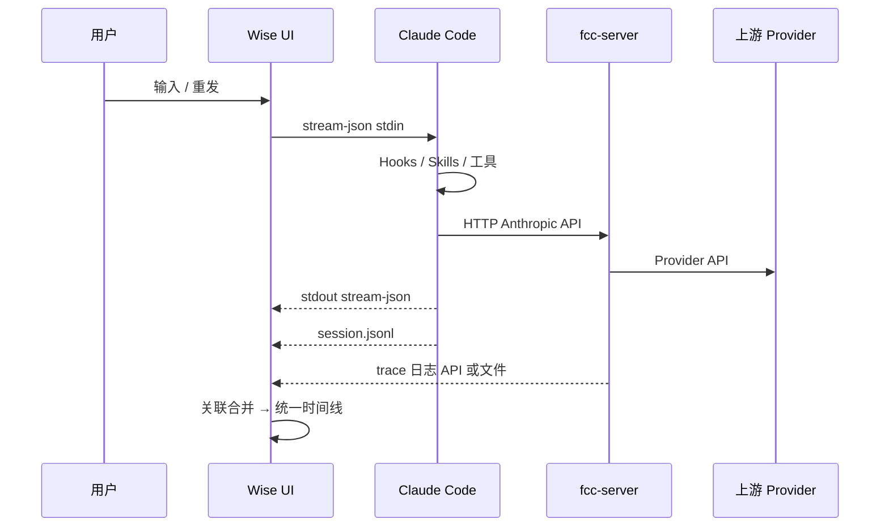

# 架构：会话全链路数据观测

## 1. 目标架构（逻辑视图）



Wise 作为 **汇聚与分析面**，不替代 FCC 转发职责（除非用户显式开启 LLM 代理作分析通道）。

---

## 2. 数据源与信任边界

| 数据源 | 所有者 | 信任级别 | 典型字段 |
|--------|--------|----------|----------|
| 内存 `ClaudeMessage[]` | Wise UI | 实时、可能未落盘 | role, parts, tool_use id |
| `session.jsonl` | Claude Code | **工具/hook 事实** | type, message, tool_use_id |
| stdout `stream-json` | Claude 子进程 | 实时、与 JSONL 大致一致 | 同 SDK 行 |
| `ClaudeLlmProxyRecord` | Wise | **仅代理路径** HTTP | method, path, body preview |
| FCC trace（待建） | fcc-server | **直连 HTTP 事实** | request_id, latency, model, body 摘要 |
| FCC Admin | fcc-server | 配置与运营 | Provider、配额等 |

**规则**：分支展示与导出时，L3–L4 以 JSONL 为准纠错 UI；L5 以 FCC trace 或 LLM 代理记录为准，不用合成 `api_request` 占位。

---

## 3. 关联键模型（Correlation）

统一时间线中的每条记录应携带可扩展元数据：

```typescript
interface SessionLinkRecord {
  /** Wise 标签会话或 Claude session_id */
  sessionKeys: {
    wiseTabSessionId?: string;
    claudeSessionId?: string;
  };
  /** 单调时间 */
  timestampMs: number;
  /** 层级 */
  layer: "input" | "protocol" | "tool" | "hook" | "http" | "fcc_upstream";
  /** 层内类型 */
  kind: string;
  /** 轮次（从 user_input 递增，工具往返不增轮） */
  turnIndex?: number;
  toolUseId?: string;
  messageId?: number;
  /** FCC / 代理 HTTP */
  httpTraceId?: string;
  /** 原始引用 */
  refs?: {
    jsonlLineNo?: number;
    llmProxyRecordId?: string;
    fccTraceId?: string;
  };
  /** 展示与导出 */
  summary: string;
  detail?: string;
  payload?: unknown;
}
```

### 3.1 轮次（turn）定义

- **新轮**：非纯 `tool_result` 的用户输入（含首条 prompt）。
- **同轮**：该轮内的 thinking、assistant_text、tool_use、tool_result、以及 **属于该轮的 HTTP trace**。
- **对齐策略**（Phase 2）：
  - 优先：FCC 若回传 `x-anthropic-request-id` 或与 Claude SDK 一致的 id，直接挂载。
  - 兜底：HTTP `timestampMs` 落在 `[last_tool_result, next_assistant]` 或 `[user_input, first_assistant]` 时间窗内。

### 3.2 与 Mission / Trellis 的关系

- `mission_runs.correlation_id` / `trellis_runtime_events.correlation_id`：**编排域**，可选在导出包中附带，不强制写入每条 `SessionLinkRecord`。
- 会话内分析默认 **不依赖** Mission 表。

---

## 4. FCC 直连下的 HTTP 观测策略

| 方案 | 描述 | 生产适用 | Wise 改动 | FCC 改动 |
|------|------|----------|-----------|----------|
| **A. 分析期 LLM 代理** | Claude → Wise 代理 → FCC | 可选 | 已有；文档化上游=FCC | 无 |
| **B. FCC trace 契约**（推荐） | FCC 记请求，Wise 拉取/订阅 | ✅ | IPC + 合并时间线 | 日志 API 或文件 |
| **C. 外部抓包** | mitm / tcpdump 127.0.0.1:PORT | 手工 | 无 | 无 |
| **D. stream-json 推断** | 仅从 stdout 拼片段 | 仅兜底 | 已有 `streamJsonLlmProxyIngest` | 无 |

**推荐组合**：日常 **B**；排障 **A**；**D** 仅当 B/A 均不可用。

### 4.1 FCC trace 契约（草案，Phase 2 与上游对齐）

任选其一或并存：

1. **文件**：`~/.fcc/traces/<YYYY-MM-DD>/<traceId>.json`  
   字段：`timestampMs`, `method`, `path`, `statusCode`, `durationMs`, `model`, `requestBodySha256`, `requestPreview`, `responsePreview`, `sessionHint?`, `anthropicRequestId?`

2. **HTTP API**：`GET /admin/api/traces?since=&limit=`（需 `ANTHROPIC_AUTH_TOKEN` 或 Admin 会话）

3. **实时**：`GET /admin/api/traces/stream`（SSE，Wise 订阅后写入内存 ring buffer）

Wise Tauri 新增（命名待定）：

- `list_fcc_traces(since_ms, limit)`
- `get_fcc_trace(trace_id)`

前端：在工作轨迹或独立 **「链路分析」** 抽屉中合并展示。

---

## 5. 统一时间线（Unified Timeline）— 目标 UI

在现有 **工作轨迹** 上演进，而非新建孤立页面（Phase 3 可拆独立分析页）。

### 5.1 泳道扩展（可选）

| 泳道 | 内容 |
|------|------|
| user | 用户输入 |
| claude_code | 工具、hook、skill、子代理 |
| model（Claude 可见） | thinking、assistant、**真实** HTTP 摘要 |
| fcc（可选第四泳道） | FCC→上游 转发摘要 |

或保持三泳道，将 FCC→上游 折叠进 `model` 节点 detail。

### 5.2 节点类型演进

| 现有 `SequenceEventKind` | 演进 |
|--------------------------|------|
| `api_request`（合成） | 有 FCC trace 时改为 `http_request` 并附 `httpTraceId`；无 trace 时降级为虚线「未观测」 |
| 新增 `http_response` | 状态码、token、latency |
| 新增 `fcc_upstream` | Provider 侧摘要（若 FCC 提供） |

### 5.3 导出格式（Phase 1）

**会话链路包** `session-link-export-<claudeSessionId>-<iso>.json`：

```json
{
  "exportedAt": "2026-05-23T12:00:00.000Z",
  "session": { "claudeSessionId": "...", "repositoryPath": "..." },
  "records": [ "/* SessionLinkRecord[] */" ],
  "sources": {
    "jsonlTailLines": 8000,
    "llmProxyRecordCount": 0,
    "fccTraceCount": 12
  }
}
```

---

## 6. 安全与隐私

- HTTP body 预览默认 **截断**（对齐 `claude_llm_proxy` 的 `MAX_BODY_CAPTURE` 策略）。
- 导出前提示可能含 **代码、密钥、PII**；支持「仅元数据」导出模式。
- FCC trace API 仅监听 `127.0.0.1`，不扩大 Tauri capability 到广域网。

---

## 7. 非目标（本方案不做）

- 替换 Claude Code 或 FCC 的认证模型。
- 强制所有用户经 Wise LLM 代理（生产默认仍为 FCC 直连）。
- 在 Wise 内重放/修改 HTTP 请求（只读观测）。

---

## 8. 与产品宪法的关系

实施 Phase 2+ 时，若新增顶栏入口或 Inspector 域面板，应先对照 `.trellis/spec/guides/agent-harness-architecture.md` 的 Operator / Inspector 划分；默认将会话内 **工作轨迹** 扩展为链路分析入口，避免新增永久顶层菜单。
